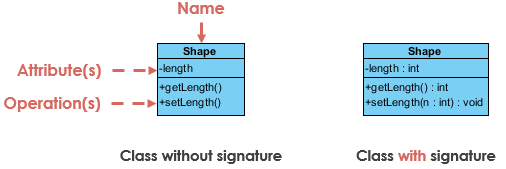
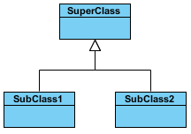
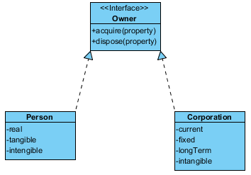

# UML

## UML 类图

### 类和对象

**类**

- 象的蓝图;
- 表述对象的属性和方法;

**对象**

- 类的实例;
- 相同类的对象具有相同的属性和方法;

### UML 类符号

**组成**

- 名称;
- 属性;
- 方法;

**可见性**

- +: 公共属性;
- -: 私有属性;
- \#: 受保护的属性;

### 类图的视角

**类图的视角**

- 概念: 代表某个概念;
- 规范: 注重于接口;
- 实现: 注重于如何实现接口;

### 类之间的关系

**继承(泛化)**

- is a 的关系;
- 实线 + 空心三角;

**实现**

- 接口(抽闲基类)和实现类之间的关系;
- 规定类必须实现的方法;
- 虚线 + 实心三角;

**关联**

- 表示类之间存在联系;
- 实线;

**聚合**

- 特殊的关联;
- 表示 A is part of B 的关系;
- A 和 B 具有独立的生命周期;
- 实线 + 空心菱形(B 处);

**组合**

- 特殊的聚合;
- 表示 A is part of B 的关系;
- A 和 B 的生命周期相同;
- 实线 + 实心菱形(B 处);

**依赖**

- 特殊的关联;
- A 的方法使用 B, 但 B 不是 A 的属性, B 的更改会导致 A 的变化;
- 虚线 + 箭头 (B 处);

