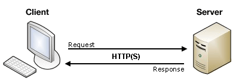

# 表单验证和发送数据

## 表单验证

**分类**

- 客户端验证;
- 服务端验证.

### 客户端验证

**客户端验证**

- 在用户本地,
- 对表单输入内容进行类型验证.

**局限**

- 但不要将其视为严密的安全措施,
- 服务器端同样对其验证,
- 因为客户端验证极其容易关闭,
- 造成安全隐患.

#### 内置表单验证

**相关属性**

- required;
- minlength/maxlength;
- min/max;
- type;
- pattern.

**相关伪类机制**

- 若表单内容通过验证,
- :valid 和 in-range 为真,
- 反之 :invalid 和 :out-of-rage 为真.

**示例**

```html
<form>
  <p>
    <fieldset>
      <legend>Do you have a driver's license?<span aria-label="required">*</span></legend>
      <input type="radio" required name="driver" id="r1" value="yes"><label for="r1">Yes</label>
      <input type="radio" required name="driver" id="r2" value="no"><label for="r2">No</label>
    </fieldset>
  </p>
  <p>
    <label for="n1">How old are you?</label>
    <input type="number" min="12" max="120" step="1" id="n1" name="age"
           pattern="\d+">
  </p>
  <p>
    <label for="t1">What's your favorite fruit?<span aria-label="required">*</span></label>
    <input type="text" id="t1" name="fruit" list="l1" required
           pattern="[Bb]anana|[Cc]herry|[Aa]pple|[Ss]trawberry|[Ll]emon|[Oo]range">
    <datalist id="l1">
      <option>Banana</option>
      <option>Cherry</option>
      <option>Apple</option>
      <option>Strawberry</option>
      <option>Lemon</option>
      <option>Orange</option>
    </datalist>
  </p>
  <p>
    <label for="t2">What's your e-mail address?</label>
    <input type="email" id="t2" name="email">
  </p>
  <p>
    <label for="t3">Leave a short message</label>
    <textarea id="t3" name="msg" maxlength="140" rows="5"></textarea>
  </p>
  <p>
    <button>Submit</button>
  </p>
</form>
```

// SKIP 学完 js 再看

#### JavaScript 验证

## 发送表单数据

**相关属性**

- action;
- method.

### CS 构架

**CS 构架**

- Client: 客户端;
- Server: 服务端;
- HTTP: 通信协议.

**示意图**



### action 属性

**作用**

- 设置发送数据至服务器的位置.

**语法格式**

```html
<form action="https://example.com"></form>
<form action="/somewhere_else"></form>
```

### method 属性

**作用**

- 设置表单发送数据方式.

**语法格式**

```html
<form action="http://www.foo.com" method="GET"></form>
<form action="http://www.foo.com" method="POST"></form>
```

#### GET 属性值

**作用**

- 表示浏览器需接受服务器的返回数据.

**机制**

- 发送一个空的 body,
- 如果表单通过该方法发送表单数据,
- 表单数据添加到 url 中.
  - ? 分隔 url 和表单数据;
  - 表单数据使用 `name=value` 的键值对形式;
  - & 分隔键值对.

```html
<form action="http://www.foo.com" method="GET">
  <div>
    <label for="say">What greeting do you want to say?</label>
    <input name="say" id="say" value="Hi" />
  </div>
  <div>
    <label for="to">Who do you want to say it to?</label>
    <input name="to" id="to" value="Mom" />
  </div>
  <div>
    <button>Send my greetings</button>
  </div>
</form>

<!-- result -->
<!-- www.foo.com/?say=Hi&to=Mom -->
```

**http 请求**

- GET: GET /content HTTP/2.0;
  - content 同添加到 url 的表单数据格式.
- Host: 主机域名.

```http
GET /?say=Hi&to=Mom HTTP/2.0
Host: foo.com
```

#### POST 属性值

**作用**

- 表示浏览器向服务器发送数据,
- 并接受服务器根据该数据返回的数据.

```html
<form action="http://www.foo.com" method="POST">
  <div>
    <label for="say">What greeting do you want to say?</label>
    <input name="say" id="say" value="Hi" />
  </div>
  <div>
    <label for="to">Who do you want to say it to?</label>
    <input name="to" id="to" value="Mom" />
  </div>
  <div>
    <button>Send my greetings</button>
  </div>
</form>
```

**http 请求**

- POST: POST / HTTP/2.0;
- Host: 主机域名;
- Content-Type: 发送数据类型;
- Content-Length: 发送数据大小.
- body content.
  - 表单数据使用 `name=value` 的键值对形式;
  - & 分隔键值对.

```http
POST / HTTP/2.0
Host: foo.com
Content-Type: application/x-www-form-urlencoded
Content-Length: 13

say=Hi&to=Mom
```

### http 请求

**查看方法**

- developer tools - Network,
- 选择 All,
- 选择查看 url,
- 选择 Headers.

**GET 和 POST 使用场景**

- 隐私数据使用 POST;
  - GET 会将数据明文显示至 URL.
- 大数据使用 POST;
  - 浏览器 URL 长度有限;
  - 大部分服务器限制 URL 长度.

#### 服务端处理 http 请求

- 根据使用的编程语言和框架而定.

### 发送文件

**文件的特殊**

- 文件为二进制数据,
- 而 http 请求为文本数据.

#### enctype 属性

**作用**

- 设置 Content-Type 的值.

**发送文件步骤**

- 使用 POST 属性值;
- enctype 属性值设置为 multipart/form-data;
- \<input\> type 属性值设置为 file.

```html
<form method="post" action="https://www.foo.com" enctype="multipart/form-data">
  <div>
    <label for="file">Choose a file</label>
    <input type="file" id="file" name="myFile" />
  </div>
  <div>
    <button>Send the file</button>
  </div>
</form>
```

### 安全问题

**原则**

- 不要相信你的用户;
- 谨慎对待具有潜在危险的字符序列;
- 限制传入的数据大小;
  - 只传必需数据.
- 传入文件隔离.
  - 放置于不同服务器,
  - 通过不同子域甚至不同域名访问.
