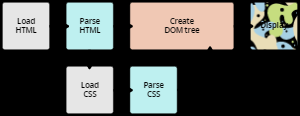
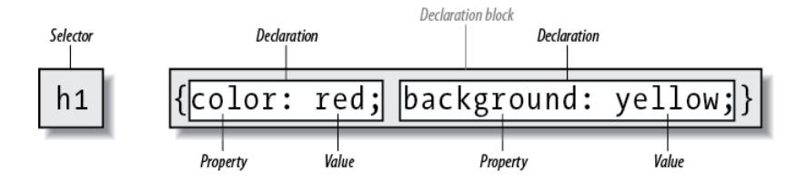

# css 导论

## css 作用

**css 作用**

- 修饰 html 文档.

## css 工作原理

### 工作流程

**工作流程**

- 加载 html,
- 解析 html, 构造 dom,
- 加载外部资源,
  - 多媒体;
  - css.
- 解析 css, 应用至 dom;
- 显示网页.



### dom

**dom**

- 树状结构.

### 浏览器解析 css 原则

**浏览器解析 css 原则**

- 成功解析则应用,
- 否则忽略.

## css 应用至 html

### 外部样式表

**位置**

- \<head\> element.

**语法格式**

- \<link\> element.
  - attribute.
    - rel: _stylesheet_;
    - style.

```html
<!DOCTYPE html>
<html>
  <head>
    <meta charset="utf-8" />
    <title>My CSS experiment</title>
    <link rel="stylesheet" href="styles.css" />
  </head>
  <body>
    <h1>Hello World!</h1>
    <p>This is my first CSS example</p>
  </body>
</html>
```

### 内部样式表

**语法格式**

- \<style\> element.

```html
<!DOCTYPE html>
<html>
  <head>
    <meta charset="utf-8" />
    <title>My CSS experiment</title>
    <style>
      h1 {
        color: blue;
        background-color: yellow;
        border: 1px solid black;
      }

      p {
        color: red;
      }
    </style>
  </head>
  <body>
    <h1>Hello World!</h1>
    <p>This is my first CSS example</p>
  </body>
</html>
```

### 内联样式

**语法格式**

- style attribute.

```html
<!DOCTYPE html>
<html>
  <head>
    <meta charset="utf-8" />
    <title>My CSS experiment</title>
  </head>
  <body>
    <h1 style="color: blue;background-color: yellow;border: 1px solid black;">Hello World!</h1>
    <p style="color:red;">This is my first CSS example</p>
  </body>
</html>
```

**是否推荐**

- 如无必要,
- 请勿使用.

## 样式表内容

### css rule 结构



## 空白

**分类**

- 空格;
- 换行符;
- 制表符.

**浏览器空白机制**

- 浏览器忽视空白.

**作用**

- 分隔属性值;
- 代码可读性.

### css 注释

**语法格式**

```css
/* comment */
```
