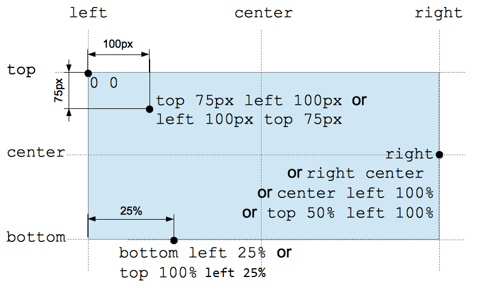

# 值, 单位和函数

## 数字类型

### \<integer\> 类型

**integer**

- 整数.

**语法格式**

```integer
12          Positive integer (without a leading + sign)
+123        Positive integer (with a leading + sign)
-456        Negative integer
0           Zero
+0          Zero, with a leading +
-0          Zero, with a leading -
```

### \<number\> 类型

**number**

- 整数 + 浮点数.

**语法格式**

```number
12          A raw <integer> is also a <number>.
4.01        Positive fraction
-456.8      Negative fraction
0.0         Zero
+0.0        Zero, with a leading +
-0.0        Zero, with a leading -
.60         Fractional number without a leading zero
10e3        Scientific notation
-3.4e-2     Complicated scientific notation
```

### \<dimension\> 类型

**dimension**

- number + unit.

**语法格式**

```dimension
12px      12 pixels
1rem      1 rem
1.2pt     1.2 points
2200ms    2200 milliseconds
5s        5 seconds
200hz     200 Hertz
200Hz     200 Hertz (values are case insensitive)
```

#### \<length\> 类型

**绝对长度**

- px.

**相对长度**

- vw;
- vh;
- ex;
- em;
- rem.

### \<percentage\> 类型

**percentage**

- 百分数.

**语法格式**

```percentage
12%         Positive integer (without a leading + sign)
+123%       Positive integer (with a leading + sign)
-456%       Negative integer
0%          Zero
+0%         Zero, with a leading +
-0%         Zero, with a leading -
```

## 特殊类型

### \<color\> 类型

**\<color\> 属性值**

- keyword;
- 十六进制值;
- rgb;
- rgba;
- hsl;
- hsla;

```css
/* keyword */
background-color: red;
/* 十六进制值 */
background-color: #ff0000;
/* rgb(a) */
background-color: rgb(255, 0, 0);
background-color: rgb(255, 0, 153, 1);
/* hsl(a) */
background-color: hsl(0, 100%, 50%);
background-color: hsl(0, 100%, 50%, 1);
```

### \<image\> 类型

**[\<image\>](https://developer.mozilla.org/en-US/docs/Web/CSS/image)**

- url();
- \<gradeient\>.

```css
background-image: url("star.gif");
background-color: linear-gradient(#f69d3c, #3f87a6);
```

### \<position\> 类型

**\<position\> 属性值**

- keyword;
  - left/right;
  - top/bottom;
  - center.
- \<length\> 类型;
- \<percentage\> 类型.

**定位机制**

- 左上角起点;
- 右和下为正方向.

**多值语法**

- 1 - value;
  - keyword: keyword + center (other axis);
  - value: value (x) + center (y).
- 2 - value.
  - keyword + keyword: keyword (对应方向);
  - keyword + value: keyword (对应方向) + value (另一方向);
  - value + value: x + y.
- 4 - value.
  - keyword value keyword value;
    - keyword: 对应方向;
    - value: 对应方向偏移.



## 函数

### cal() 函数

**语法格式**

- property: calc(expression),
- 运算符号.
  - +;
  - -;
  - -
  - /.
- 书写原则.
  - 运算符号前后必须加空格.

```python
width: calc(100% - 80px);
```

**作用**

- 混合计算多种属性值.
