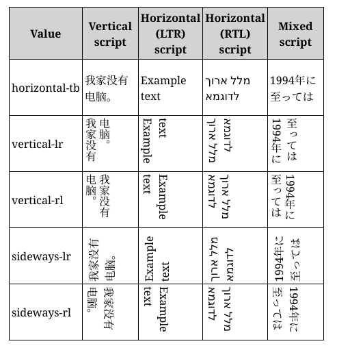
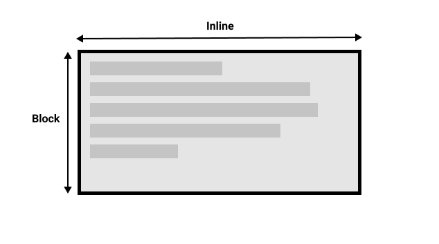
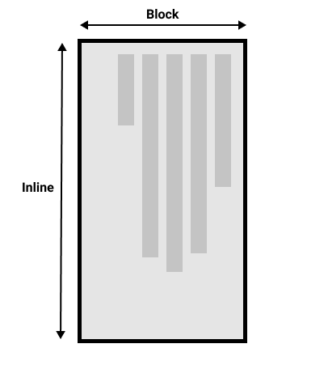

# 文本

## writing-mode 属性

**语法格式**

```css
.example {
  writing-mode: horizontal-tb;
}
```

**作用**

- 定义书写模型.

### 属性值

**horizontal-tb**

- 横向;
- 从左到右.

**vertical-rl**

- 纵向;
- 从右到左.

**vertical-lr**

- 纵向;
- 从左到右.



## 块级布局和内联布局




## 文本布局

### text-align 属性

**作用**

- 水平对齐方式.

**语法格式**

```css
.example {
  text-align: start;
}
```

#### 属性值

**start**

- left to right: left;
- right to left: right.

**end**

- left to right: right;
- right to left: left.

**left**

- 左对齐;

**right**

- 右对齐;

**center**

- 居中对齐.

**justify**

- 两端对齐.

### line-height 属性

**作用**

- 修改行间距.

**语法格式**

```css
div {
  line-height: 1.2;
  font-size: 10pt;
}
```

#### 属性值

**关键字**

- normal: 默认值.

**number**

- \<number\> 类型,
- number \* 字体大小.

**length**

- \<length\> 类型.

**percentage**

- \<percentage\> 类型.

### letter-spacing 属性

**作用**

- 修改字间距.

**语法格式**

```css
.normal {
  letter-spacing: normal;
}
```

#### 属性值

**关键字**

- normal: 默认值.

**length**

- \<length\> 类型.

### word-spacing 属性

**作用**

- 修改词间距.

**语法格式**

```css
#mozdiv1 {
  word-spacing: 15px;
}
```

#### 属性值

**关键字**

- normal: 默认值.

**length**

- \<length\> 类型.

**percentage**

- \<percentage\> 类型.

## text-transform 属性

**作用**

- 字体变换.

**语法格式**

```css
span {
  text-transform: none;
}
```

### 属性值

**none**

- 无变换.

**capitalize**

- 首字母大写.

**uppercase**

- 全大写;

**lowercase**

- 全小写.

**full-width**

- 等宽.

**global value**

- 继承相关属性.

## text-shadow 属性

**作用**

- 添加字体阴影.

**语法格式**

- offset-x | offset-y | blur-radius | color.

```css
.red-text-shadow {
  text-shadow: 1px 2px 2px red;
}
```

### 属性值

**offset-x**

- x 方向偏移.

**offset-y**

- y 方向偏移.

**blur-radius**

- 阴影半径,
- 可选.

**color**

- 阴影颜色,
- 可选.

**多个属性值叠加**

- 逗号分隔,
- 阴影叠加.

```css
.white-text-with-blue-shadow {
  text-shadow: 1px 1px 2px black, 0 0 1em blue, 0 0 0.2em blue;
  color: white;
  font: 1.5em Georgia, serif;
}
```

## 字体修饰

### text-decoration 属性

**作用**

- 添加字体修饰线.

**语法格式**

```css
.over {
  text-decoration: wavy overline lime;
}
```

**成分属性**

- text-decoration-color;
- text-decoration-line;
- text-decoration-style.

### text-decoration-color 属性

- 字体装饰线颜色,
- 同 color 属性,
- 不作详述.

### text-decoration-line 属性

**作用**

- 添加字体装饰线.

**语法格式**

```css
.both {
  text-decoration-line: underline overline;
}
```

#### 属性值

**none**

- 无装饰线.

**underline**

- 下划线.

**overline**

- 上划线.

**line-through**

- 穿过字体的线.

**多个属性值**

- 叠在一起.

### text-decoration-style 属性

**作用**

- 装饰线样式.

**语法格式**

```css
.wavy {
  text-decoration-line: underline;
}
```

#### 属性值

**solid**

- 单实线;

**double**

- 双实线.

**dotted**

- 原点.

**dashed**

- 方块.

**wavy**

- 波浪线.

## 逻辑属性

### inline-size 和 block-size 属性

**作用**

- 适用于不同书写模式.

**机制**

- inline-size: inline 方向;
- block-size: block 方向.

**属性值**

- 同 width/height 属性.

### padding, border 和 margin

**逻辑属性**

- xxx-block-start;
- xxx-block-end;
- xxx-inline-start;
- xxx-inline-end;

**上下左右对应逻辑值**

- block-start;
- block-end;
- inline-start:
- inline-end.

## 超链接样式

### 默认样式

**link**

- 下划线.

**unvisited**

- 蓝色.

**visited**

- 紫色.

**hover**

- 鼠标显示为小手图标.

**focus**

- 方框包裹.

**active**

- 红色.

### cursor 属性

**作用**

- 修改鼠标样式.

**语法格式**

```css
.bar {
  cursor: zoom-in;
}
```

#### 属性值

**auto**

- 默认值,
- 自动选择;

**default**

- 默认指针.

**none**

- 无指针.

**help**

- 帮助.

**pointer**

- 指向超链接.

**progress**

- 加载中,
- 可与程序交互.

**wait**

- 加载中,
- 不可与程序交互.

**text**

- 文本选择.

**move**

- 移动.

**not-allowed**

- 禁止.

**grab**

- 拖拽.

**x-resize**

- 调整大小.
  - col/row;
  - n/e/s/w;
  - ne/nw/se/sw;
  - ew/ns/nesw/nwse.

**zoom-in/out**

- 放缩.
