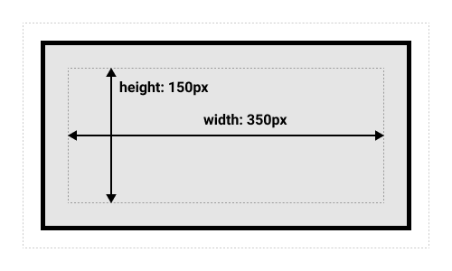
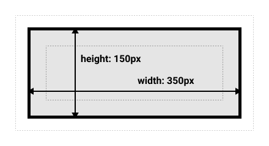

# 盒子模型

## display 属性

**作用**

- 控制元素显示类型.

**语法格式**

- outside;
- inside;
- outside + inside.

```css
span {
  display: block;
}

span {
  display: flex;
}

span {
  display: block flex;
}
```

### 属性值

**属性值分类**

- 外部显示类型;
  - 标签在 flow layout 中的布局.
- 内部显示类型.
  - 标签内部子标签的布局.

#### 外部属性值

**block**

- 块级标签样式.

**inline**

- 内联标签样式.

#### 内部属性值

**flow-root**

- 标签创建块级盒子,
- 创建块级上下文.

**table**

- 标签行为如同 html 中的 \<table\> 标签,
- 块级标签.

**flex**

- flex 样式.

**grid**

- grid 样式.

## 块级盒子

### 块状盒子

**特性**

- 换行;
- 具有 width/height 属性;
- padding/margin/border 会造成其他元素推出盒子;
- 盒子会沿着 inline 方向扩展以填充空白.

**常见块级标签**

- \<hx\>;
- \<p\>;
- \<div\>;
- \<ul\>;
- \<ol\>;
- \<dl\>/\<dt\>/\<dd\>.

### 标准盒子模型

**组成**

- content box;
- padding box;
- border box;
- margin box.


**宽度/高度机制**

- content box + padding box + border box.



### 替代盒子模型

**替代盒子模型**

- 盒子高度宽度包括 padding box 和 border box.



**语法格式**

```css
.box {
  box-sizing: border-box;
}
```

**全部元素使用替代盒子模型**

```css
html {
  box-sizing: border-box;
}
*,
*::before,
*::after {
  box-sizing: inherit;
}
```

## 内联盒子

**特性**

- 不自动换行;
- width/height 属性无效;
- padding/margins/borders 竖直方向无效, 水平方向有效.

**常见行内标签**

- \<a\>;
- \<span\>;
- \<strong\>;
- \<em\>;
- \<u\>.

### 内联块级盒子

**特性**

- 不自动换行;
- width/height 属性有效;
- padding/margins/borders 两方向均有效.

**语法格式**

```css
span {
  display: inline-block;
}

/* inline-block equivalent to inline flow-root */
span {
  display: inline flow-root;
}
```

## 替换元素

**替换元素**

- css 只能设置其位置,
- 无法改变其内部布局.

**常见替换元素**

- 图片;
- 视频.

**调整图像大小**

- 设置 max-height/max-width 属性;
- 设置 object-fit 属性.

**拉伸机制**

- 替换元素默认不拉伸,
- 强制拉伸如下.

```css
img {
  width: 100%;
  height: 100%;
}
```

### object-fit 属性

**作用**

- 设置替换元素显示方式.

**语法格式**

```css
.fill {
  object-fit: fill;
}
```

### 属性值

**none**

- 原始尺寸.

**contain**

- 保持纵横比,
- 尽可能拉伸放大,
- 若留下空白自动平铺,
- 可采用 no-repeat 防止.

**cover**

- 保持纵横比,
- 填满整个容器,
- 尽可能拉伸缩小,
- 多余部分裁剪.

**fill**

- 不保持纵横比,
- 填满整个容器.

**scale-down**

- none 或者 contain,
- 取尺寸小的结果.

# padding, borders, outlines 和 margins

## width 属性和 height 属性

**语法格式**

```css
.percent {
  width: 20%;
  height: 50%;
}
```

### 属性值

**keyword**

- auto: 自动;

**\<length\> 类型**

- 不做详述.

**\<percentage\> 类型**

- 不做详述.

## padding 属性

**语法格式**

```css
h3 {
  background-color: cyan;
  padding: 110px 50px 50px 110px;
}
```

**成分属性**

- padding-bottom;
- padding-left;
- padding-right;
- padding-top;

**多值语法格式**

- 1 value: 四个边;
- 2 value: 竖直 + 水平;
- 3 value: top + 水平 + bottom;
- 4 value: top + right + bottom + left.

### 属性值

**属性值**

- \<length\> 类型;
- \<percentage\> 类型.

**属性值取值范围**

- 正数.

**百分比机制**

- 无论是 height 还是 width,
- 都以父容器 inline size 为基准.

## border 属性

**作用**

- 设置 border 样式.

**成分属性**

- border-color 属性;
- border-style 属性;
- border-width 属性;

**语法格式**

```css
div {
  border: 0.5rem outset pink;
}
```

**简写属性规则**

```css
/* style */
/* color | style */
/* style | width */
/* color | style | width */
```

### border-color 属性

**作用**

- 设置 border 颜色.

**多值语法**

- 同 padding.

**属性值**

- 同 color.

**成分属性**

- border-bottom-color 属性;
- border-left-color 属性;
- border-right-color 属性;
- border-top-color 属性;

### border-style 属性

**作用**

- 设置 border 样式.

**成分属性**

- border-bottom-style 属性;
- border-left-style 属性;
- border-right-style 属性;
- border-top-style 属性;

**多值语法**

- 同 padding.

#### 属性值

**none**

- 无边框;

**hidden**

- 隐藏边框, 但还存在.

**dotted**

- 圆点.

**dashed**

- 方块.

**solid**

- 单实线;

**double**

- 双实线.

**groove**

- 雕刻样式;

**ridge**

- 挤压样式;

**inset**

- 嵌入样式.

**outset**

- 浮雕样式.

### border-width 属性

**作用**

- 设置 border 粗细.

**成分属性**

- border-bottom-width 属性;
- border-left-width 属性;
- border-right-width 属性;
- border-top-width 属性;

**多值语法**

- 同 padding.

#### 属性值

**关键字**

- thin;
- medium;
- thick.

**\<length\> 类型**

- 不作详述.

## outline 属性

**机制**

- 生成轮廓线;
- 盒子模型外的线.

**语法格式**

```css
a:focus {
  outline: 4px dotted #e73;
  outline-offset: 4px;
}
```

**与 border 属性的关系**

- 一切都和 border 一模一样.

### outline-offset 属性

**作用**

- outline 偏移量,
- 向外为正方向.

**语法格式**

```css
a:focus {
  outline: 4px dotted #e73;
  outline-offset: 4px;
}
```

**属性值**

- \<percentage\> 类型;
- \<length\> 类型.

## border-radius 属性

**作用**

- 设置 border/outline 属性圆角.

**语法格式**

```css
div {
  border-radius: 10px 100px / 120px;
}
```

**成分属性**

- border-top-left-radius;
- border-top-right-radius;
- border-bottom-right-radius;
- border-bottom-left-radius.

**多值语法**

- 单参数;
  - 1 value: 四角;
  - 2 value: 左上-右下 + 右上-左下.
  - 3 value: 左上 + 右上-左下 + 右下;
  - 4 value: 左上 + 右上 + 右下 + 左下.
- 双参数
  - / 分割,
  - 每个参数按照单参数的机制.

### 属性值

**\<length\> 类型**

- 不作详述.

**\<percentage\> 类型**

- 不作详述.

## margin 属性

**语法格式**

```css
h3 {
  background-color: cyan;
  margin: 110px 50px 50px 110px;
}
```

**成分属性**

- margin-bottom;
- margin-left;
- margin-right;
- margin-top;

**多值语法格式**

- 同 padding 属性.

### 属性值

**keyword**

- auto: 自动设置.

**\<length\> 类型**

- 不作详述.

**\<percentage\> 类**

- 不作详述.

**属性值取值范围**

- 整数.

**百分比机制**

- 无论是 height 还是 width,
- 都以父容器 inline size 为基准.

### margin 叠加

**机制**

- 两个正数: 取最大值;
- 两个负数: 取最小值;
- 一正一负: 两者相加.
