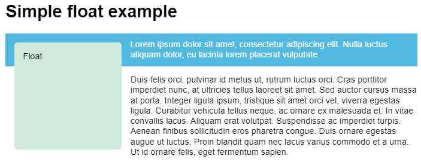

# floats 和 shapes

## float 布局

### float 属性

**作用**

- 设置 floats 布局.

**语法格式**

```css
section {
  box-sizing: border-box;
  border: 1px solid blue;
  width: 100%;
  float: left;
}
```

**float 和 normal flow 的关系**

- float 所属标签与 normal flow 分离,
- float 所属标前在 normal flow 层级之上.

**float 问题**

- float 脱离了 normal flow,
- 父标签无法获取其任何信息,
- float 所属标签依旧会对 normal flow 中的 content box 造成影响,
- 但是无法影响其 padding 和 margin box,
- 产生了所谓的 float 问题.



#### 属性值

**none**

- 无 float;

**left**

- 元素浮动在包含快的左侧.

**right**

- 元素浮动在包含快的左侧.

**inline-start**

- 逻辑属性.

**inline-end**

- 逻辑属性,

### clear 属性

**作用**

- 决定标签是否移动至其之前的 floating 标签底部.

**语法格式**

```css
.left {
  border: 1px solid black;
  clear: left;
}
```

#### 属性值

**none**

- 不移动;

**left**

- 移动至左侧 floating 标签的底部,
- 以消除浮动.

**right**

- 移动至右侧 floating 标签的底部,
- 以消除浮动.

**both**

- 移动至左右侧 floating 标签的底部,
- 以消除浮动.

**inline-start**

- 逻辑属性.

**inline-end**

- 逻辑属性,

### 清除浮动

#### clearfix hack

**语法格式**

```css
.wrapper::after {
  content: "";
  clear: both;
  display: block;
}
```

**机制**

- .wrapper 标签最后生成一个空的子标签;
- 由于其是块级标签,
- 况且 clear 属性值为 both,
- 所以该子标签必须在 floating 子标签底部,
- 从而拉高了其父标签 .wrapper 标签的高度,
- 达到清除浮动的效果.

#### using overflow

**语法格式**

```css
.wrapper {
  background-color: rgb(79, 185, 227);
  padding: 10px;
  color: #fff;
  overflow: auto; /* other than visible */
}
```

**机制**

- 块级上下文.

#### display: flow-root

**语法格式**

```css
.wrapper {
  background-color: rgb(79, 185, 227);
  padding: 10px;
  color: #fff;
  display: flow-root;
}
```

**机制**

- 块级上下文.
