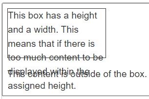

# positioning

## Width and Height

### max-width 属性

**作用**

- 设置最大宽度.

**语法格式**

```css
table {
  max-width: 75%;
}
```

#### 属性值

**关键字**

- auto: 自动设置.

**\<length\> 类型**

- 不作详述.

**\<percentage\> 类型**

- 不作详述.

### 其余属性

- min-width 属性;
- min-height 属性;
- max-height 属性.

## 溢出



### overflow 属性

**作用**

- 设置文字溢出样式.

**成分属性**

- overflow-x;
- overflow-y.

**多值属性**

- 1 value;
- 2 value: x + y.

#### 属性值

**visible**

- 文字不会被裁剪,
- 文字溢出.

**hidden**

- 文字被裁剪,
- 无滚动条,
- 但可通过对应方法滚动.

**clip**

- 文字被裁剪,
- 无滚动条,
- 不可通过任意方式滚动.

**scroll**

- 文字被裁减,
- 总是具有滚动条.

**auto**

- 文字被裁减,
- 根据需要设置滚动条.

## positioning

### position 属性

**作用**

- 设置 position 样式.

**语法格式**

```css
.positioned {
  position: relative;
}
```

**属性值**

- static;
- relative;
- absolute;
- fixed;
- sticky.

### top/bottom/left/right 属性

**作用**

- 用于定位元素位置.

#### 属性值

**关键字**

- auto: 自动设置.

**\<length\> 类型**

- 不作详述.

**\<percentage\> 类型**

- 不作详述.

### static positioning

**机制**

- normal flow 默认值,
- top/right/bottom/left/z-index 无效.

**语法格式**

```css
.positioned {
  position: static;
  background: yellow;
}
```

### relative positioning

**作用**

- 设置为 relative positioning 类型.

**语法格式**

```css
.positioned {
  position: relative;
  background: yellow;
}
```

**定位机制**

- 根据其 normal position 定位,
- 再根据 top/bottom/left/right 偏移.

### absolute positioning

**作用**

- 设置为 absolute positioning 类型.

**语法格式**

```css
.positioned {
  position: absolute;
  background: yellow;
}
```

**隔离机制**

- 脱离 normal flow,
- 与其隔离,
- 拥有自己的图层.

**定位机制**

- 根据其 containing block 计算.

### fixed positioning

**作用**

- 设置为 fixed positioning 类型.

**语法格式**

```css
.positioned {
  position: fixed;
  background: yellow;
}
```

**定位机制**

- 根据 viewport 计算.

### sticky positioning

**作用**

- 设置为 sticky positioning 类型.

**语法格式**

```css
.positioned {
  position: sticky;
  background: yellow;
}
```

**机制**

- 像是 relative 和 fixed 的混合体,
- 根据 relative 定位,
- 当其滚动到根据 viewport 定位的位置时,
- 转换成 fixed.

**定位机制**

- 根据 containing block 计算.

**scrolling index 机制**

- 当存在多个 position 属性值为 sticky 的元素时,
- 按照其次序一层层覆盖叠加.

### positioning context

**containing block**

- static/relative/sticky;
  - 最近的祖先元素,
  - 且是 block container.
- absolute;
  - 最近的祖先元素,
  - 且其 position 属性值不是 static;
- fixed:
  - viewport.

**initial containing block**

- 具有 viewport 的尺寸,
- 包含 \<html\> 标签.

**positioning context**

- position 属性值非 static 即可,
- 推荐使用 relative.

```css
.positioned {
  position: relative;
}
```

## z-index

**作用**

- 设置对应标签的 stack level.

```css
.dashed-box {
  position: relative;
  z-index: 1;
}
```

**机制**

- z-index 属性值越大,
- 其 stack level 越高,
- 当元素重叠时,
- stack level 高者优先被显示.

### 属性值

**关键字**

- auto.
  - 不建立新的 local stacking context,
  - stack level 为 0.

**\<integer\> 类型**

- 不作详述.
