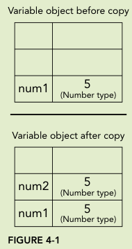
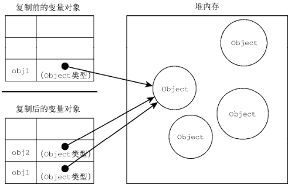

# 变量, 作用域和内存

## 原始值和引用值

### primitive values

**primitive values**

- 原生数据类型;
- 原子数据类型.

**分类**

- undefined;
- null;
- boolean;
- number;
- string;
- symbol.

**操作机制**

- 变量存储栈中 primitive values 的内存地址,
- primitive value 直接存储在栈中,
- 直接操作存储在栈里面的实际值.

### reference values

**reference values**

- 存储在栈里面,
- 是对存储在堆中的 object 的引用.

**操作机制**

- 变量存储栈中 reference values 的内存地址,
- 栈中存储 reference value 在堆中的内存地址,
- 操作对 object 的引用, 并不直接操作 object 本身.

### 动态属性

```typescript
// primitive values 无属性;
// reference values 有属性.
let name = "Nicholas";
name.age = 27;
console.log(name.age); // undefined
let person = new Object();
person.name = "Nicholas";
console.log(person.name); // "Nicholas"
```

## 复制值

**primitive value**

- 在栈中创建一个新空间,
- 然后将旧变量在栈中的实际值赋值给新空间,
- 将新空间栈中的内存地址赋值给新变量,
- 两者相互隔绝.



**reference value**

- 在栈中创建一个新空间,
- 然后将旧变量在栈中的实际值赋值给新空间,
- 将新空间栈中的内存地址赋值给新变量,
- 但新变量在栈中的对应值是指向对象的堆内存地址,
- 两者实际还是指向一个对象.

```typescript
let obj1 = new Object();
let obj2 = obj1;
obj1.name = "Nicholas";
console.log(obj2.name); // "Nicholas"
```



## 传递参数

**机制**

- JavaScript 中的函数参数全是值传递,
- 将其一个副本传递给函数内部,
- 对于 primitive value,
  - 传递其 value 的副本,
  - 两者相互隔离,
  - 函数内部的改变不会影响函数外部.
- 对于 reference value,
  - 传递其 value 副本,
  - 但 reference value 是指向 object 的指针,
  - 其副本依旧指向 object,
  - 函数内部的改变会影响函数外部.

```typescript
function setName(obj) {
  obj.name = "Nicholas";
  obj = new Object();
  obj.name = "Greg";
}
let person = new Object();
setName(person);
console.log(person.name); // "Nicholas"
```

## typeof 和 instanceof

### typeof 操作符

**语法格式**

```typescript
// 检测 reference value 和 primitive value 数据类型
let message = "some string";
console.log(typeof message); // "string"
```

**返回值**

| 检测对象       | 返回值      |
| -------------- | ----------- |
| undefined      | "undefined" |
| Boolean        | "boolean"   |
| string         | "string"    |
| number         | "number"    |
| object or null | "object"    |
| function       | "function"  |
| symbol         | "symbol"    |

**function**

- ECMA-262 规定具有 call 方法的对象返回 function,
- 正则表达式同样具有 call, 故也返回 function;

### instanceof 操作符

**作用**

- 检测 reference value 具体数据类型.

**语法格式**

```typescript
// 判断 variable 是否是 constructor 的实例
console.log(person instanceof Object); // is the variable person an Object?
console.log(colors instanceof Array); // is the variable colors an Array?
console.log(pattern instanceof RegExp); // is the variable pattern a RegExp?
```

**variable instanceof object**

- 检测 reference value, 总是 true,
- 检测 primitive value, 总是 false.

## 执行上下文和作用域

### 基本概念

**execution context**

- variable 和 function 所属的 execution context,
- 决定其可以获取什么位置的数据.

**execution context 原生类型**

- global;
- function.

**关联机制**

- 每一个 execution context 均关联一个 variable object,
- 所有定义的变量和函数都存储在其身上,
- 不可直接访问, 但时刻隐藏在幕后.

**顶级声明的 var, let, const**

- var 声明的变量和函数绑定在 window 对应的 variable object 上,
  - 作为其属性和方法.
- let, const 声明的变量和函数不绑定在 window 对应的 variable object 上,
  - 但以同样的方式在 scope chain 上解析.

**销毁机制**

- 一旦所属的全部代码运行完毕,
- execution context 及其其绑定的变量和函数销毁,
  - 其中 global context 在应用结束时销毁.

### 全局上下文

**global execution context**

- 最外层的 execution context,
- 浏览器中为 window object.

### 函数作用域

- 函数具有自己的 execution context,
- 一旦进入一个函数,
- 函数的 execution context 进入 context stack,
- 函数结束退出 context stack.

### 块作用域

- 块作用域机制同函数作用域机制,
- 但不同于函数作用域,
- 其仅对 let 和 const 生效,
- var 所属 variable object 为最近的外层函数或 global object.

### 作用域链

**作用**

- 对于可访问的 execution context 中的变量和函数,
- 设置其访问顺序.

**组成**

- 首先是自身所在 context 的 variable object;
- 其次是父级 context 中的 variable object,
- 以此类推, 直至到达 global context.

**访问顺序机制**

- 首先访问所在 context 中的变量和函数;
- 随后依次访问 scope chain 中 variable object 所关联的变量和函数;

### 标识符查找机制

- 首先沿着 scope chain 查找;
- 由于 object 同时还具有 prototype chain;
- 故两者同时进行;
- 直至搜索至 global context;
- 若仍未查找到返回错误;

### 作用域链增强

**机制**

- 特定语句临时在 scope chain 前增加 variable object,
- 代码结束后移除.

**特定语句**

- try-catch 语句中的 catch 块;
  - 创建一个新的 variable object 至 scope chain 开头.
- with 语句.
  - 移动一个指定 variable object 至 scope chain 开头.

**with 机制详解**

```typescript
// scope chain 中,
// 对象 o 所属 variable object 在 buildUrl() 后面,
// 利用 with 语句,
// 临时将其添加至 scope chain 前面,
// 故可访问 buildUrl() 中的 qs 变量,
// 并在 对象 o 中创建变量 url
// 代码执行完毕, 将其移除,
// 又因为对象 o 所属 variable object 本身在 buildUrl() 所属 varaible object 后面,
// 故 buildUrl() 可访问变量 url.
let o = { href: "kxh" };
function buildUrl() {
  let qs = "?debug=true";
  with (o) {
    href = "2222";
    var url = href + qs;
  }
  return url;
}
var result = buildUrl();
console.log(result); // 2222?debug=true
```

## 垃圾回收

### 基本概念

**js 垃圾回收**

- js 自动进行垃圾回收;
- 即自动释放内存, 释放不再使用的变量;

### 垃圾回收策略

**mark-and-sweep**

- 每当变量进入 context, 其被标记;
- 每当 garbage collector 运行时;
- 记录所有存储在内存中的变量并清除其标记;
- 最后销毁仍被标记的变量及释放其内存;

**reference counting**

- 记录每个值被各变量引用多少次;
- 当引用次数为 0 时释放其内存.

**circular reference 问题**

```typescript
// A 和 B 循环引用
// 对象 A 和 B 的 reference counting 永远增加两次
// 永远不会释放其内存
// 可通过手动赋值 null 解决
function problem() {
  let objectA = new Object();
  let objectB = new Object();
  objectA.someOtherObject = objectB;
  objectB.anotherObject = objectA;
}
```

### 性能

**主要问题**

- garbage-collection 耗费较大,
- 需要寻找一个好时机去清理垃圾,
- 以防影响设备性能.

**确定时机**

- 依赖于 js 运行时环境,
- 一般根据 object 的数量和大小确定.

### 内存管理

**背景**

- web 内存使用相比于桌面程序少得多;
- 限制了变量声明, 调用栈和单线程句柄的性能;

### 最佳实践

**手动垃圾回收**

- 当数据不再使用时;
- 手动赋值 null;
  - 手动赋值 null 并不会自动释放对应变量内存;
  - 而是确保其下一次垃圾回收时一定被清理;

**let 和 const**

- 多多使用 let 和 const;
- 因为其块作用域;
- 更容易被垃圾回收;

**hidden classes**

- v8 引擎在运行时创建 hidden classes 连接每个 object,
- 共享同一个 hidden classes 的 object 具有更好的性能.
- 优化原则;
  - 设计 object 时预先设计所有属性;
  - 初始化和删除属性时赋值 null;
