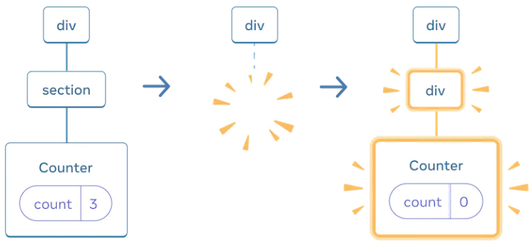
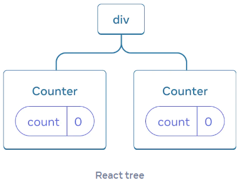
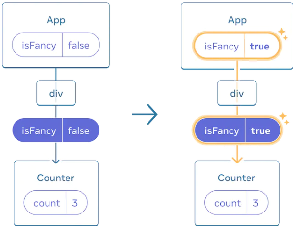

# 状态

## State

### useState

**语法格式**

```typescript
// 导入
import { useState } from "react";
// 使用
const [index, setIndex] = useState(0);
```

**私有性**

- state 私有, 只在声明组件改变,
- 同一组件的多个实例的 state 是相互独立隔绝的.

### 共享 state

- 把 state 添加至多个组件共同的父组件,
- 通过 event handle 作为属性将 set function 传递给子组件,
- 使子组件改变父组件的 state.

### 更新 object 和 array

**更新机制**

- array 和 object 在 react 是 mutable;
- 但你要视其为 readonly;
- 不能改变在 state 中已经存在的 array 或 object.
  - 改变了也没有什么作用;
  - 因为仅仅改变的是快照;
  - 并不会改变其值;

**更新方法**

- 使用 ... 操作符创建 object 副本;
  - 嵌套对象需要嵌套使用 ... 操作符;
- 使用 ...操作符, concaat(), filter(), slice() 和 map() 方法创建 array 副本;

### state 更新机制

**state 的更新时间**

- react 只有执行完 event handler 所有语句后才会更新 state;
- state 只有在调用 event handler 后的下一次渲染中才会更新.

**state 的快照机制**

- state 存储于组件之外,
- 每一次需要 state 时,
- 复制当前渲染 state 的一个快照供 react 使用;
  - 该快照的值不会随 state 的更新而改变.

**队列机制**

- 同一实例的同一 state 共用一个队列;
  - 若使用 setTimeout() 延迟若干语句执行, 同时触发多次 set function;
  - 延迟语句会在同一队列之上排队;
- 根据语句顺序形成一个队列依次执行;
  - react 返回当前 state 快照;
  - 执行队列第一个 set function 更新 state;
  - react 重新渲染;
  - react 返回渲染后的 state 快照;
  - 执行队列第二个 set function 更新 state;
  - ...

### updater function

**updater function**

- 给 state set function 传递一个箭头函数;
- 该箭头函数称为 updater function.

**命名规范**

```typescript
// 通常会使用 updater function 的每个单词的首个字母命名其箭头函数的参数
setEnabled((e) => !e);
setLastName((ln) => ln.reverse());
setFriendCount((fc) => fc * 2);
```

**updater function 和其余值**

```typescript
// updater function 使用前一个语句的返回值进行更新计算
<button
  onClick={() => {
    setNumber((n) => n + 1); // setNumber(0 + 1);
    setNumber((n) => n + 1); // setNumber(1 + 1);
    // 结果为 2
  }}
>
</button>
// 其余值仅将自身值赋值给 state variable
<button
  onClick={() => {
    setNumber(number + 5); // setNumber(0 + 5);
    setNumber((n) => n + 1); // setNumber(5 + 1);
    setNumber(42); // setNumber(42);
  }}
>
</button>;
```

### 重置 State

**The UI tree**

- react 使用树状结构管理 UI;
- 通过 JSX 生成;
- 用于更新浏览器 DOM.

**UI tree 移除机制**

- 当 UI Tree 中某个节点被移除时;
- 其所有子节点全部被移除;



**state 存储机制**

- state 存储在 react 中,
- 根据其对应的 component 在 UI Tree 中的位置,
- 存储在 UI Tree 的对应位置中,
- 不同实例中的相同 state 是相互隔离的



**state 重置机制**

- state 只有在对应组件实例在 UI tree 中的位置发生变化或移除时,
- state 才会在 react 下一次渲染中重置,
- 只要是同一组件, 且在 UI Tree 中位置不变,
- 无论该位置的组件是否为同一实例,
- react 就视其为同一个实例,
- 所在位置的 state 值不会发生重置.



**重置同一位置的 state**

```typescript
// 在不同位置渲染同一组件的不同实例
const Scoreboard = ()=> {
  const [isPlayerA, setIsPlayerA] = useState(true);
  return (
    <div>
      {isPlayerA && <Counter person="Taylor" />}
      {!isPlayerA && <Counter person="Sarah" />}
      <button onClick={() => setIsPlayerA(!isPlayerA);}>Next player!</button>
    </div>
  );
}
// 设置 key 属性
const Scoreboard = () => {
  const [isPlayerA, setIsPlayerA] = useState(true);
  return (
    <div>
      {isPlayerA ? <Counter key="Taylor" person="Taylor" /> : <Counter key="Sarah" person="Sarah" />}
      <button onClick={() => setIsPlayerA(!isPlayerA);}>Next player!</button>
    </div>
  );
}
```

### State 设计原则

```typescript
// 合并相似变量
const [x, setX] = useState(0);
const [y, setY] = useState(0);
const [position, setPosition] = useState({ x: 0, y: 0 });
// 避免相互矛盾状态
const [isOpen, setIsOpen] = useState(true);
const [isClose, setIsClose] = useState(false);
const [status, setStatus] = useState("open");
// 避免不必要 state
const [firstName, setFirstName] = useState("");
const [lastName, setLastName] = useState("");
const [fullName, setFullName] = useState("");
const [firstName, setFirstName] = useState("");
const [lastName, setLastName] = useState("");
const fullName = firstName + " " + lastName;
// 避免不同 state 之间重复存储相同数据
const [items, setItems] = useState(initialItems);
const [selectedItem, setSelectedItem] = useState(items[0]);
const [items, setItems] = useState(initialItems);
const [selectedId, setSelectedId] = useState(0);
// 避免过多层级
earth = {
  id: 0,
  child: [
    {
      id: 1,
      child: [
        {
          id: 2,
        },
      ],
    },
  ],
};
```

## Reducer

### useReducer

**dispatch**

```typescript
// action 用于描述该函数作用
// action 属性自定义
// 惯例至少使用 type 属性
function handleDeleteTask(taskId) {
  dispatch(
    // "action" object:
    {
      type: "deleted",
      id: taskId,
    }
  );
}
```

**stateReducer**

```typescript
function yourReducer(state, action) {
  // return next state for React to set
  switch (action.type) {
    case "added": {
      return [
        ...tasks,
        {
          id: action.id,
          text: action.text,
        },
      ];
    }
    case "deleted": {
      return tasks.filter((t) => t.id !== action.id);
    }
    default: {
      throw Error("Unknown action: " + action.type);
    }
  }
}
```

**使用 useReducer**

```typescript
import { useReducer } from "react";

export default function TaskApp() {
  // useReducer() hook
  //  state: state 当前值
  //  dispatch: dispatch 函数
  //  stateReducer: reducer 函数
  //  initialState: state 初始值
  const [state, dispatch] = useReducer(stateReducer, initialState);

  // dispatch 函数
  function handleAddTask(text) {
    // ...
  }

  // ...
}

function yourReducer(state, action) {
  // return next state for React to set
  // ...
}
```

### useState 和 useReducer 的区别

**useReducer 的优点**

- useReducer 具有更少的代码量;
- useReducer 具有更好的可读性;
- useReducer 具有更容易调试;
- useReducer 具有更容易测试;

### 使用原则

- reducers 必须具有纯粹性;
  - 不能改变之前存在的变量或对象;
  - 输入相同参数, 输出相同结果;
- 每一个 action 只进行一种操作.

## Context

### useContext

**createContext**

```typescript
// 单独文件中创建 context
import { createContext } from "react";

// initialValue: context 初始值
export const LevelContext = createContext(initialValue);
```

**LevelContext**

```typescript
// 定义 context 范围
import { LevelContext } from "./LevelContext.js";

export default function Section({ level, children }) {
  return (
    <section className="section">
      <LevelContext.Provider value={level}>{children}</LevelContext.Provider>
    </section>
  );
}
```

**useContext**

```typescript
// 使用 useContext
import { useContext } from "react";
import { LevelContext } from "./LevelContext.js";

export default function Heading({ children }) {
  const level = useContext(LevelContext);
  // ...
}
```

### Context 运算机制

```typescript
// 组件可以使用上一层级中的 context
// 可以基于其层级对 context 进行运算
export default function Section({ children }) {
  const level = useContext(LevelContext);
  return (
    <section className="section">
      <LevelContext.Provider value={level + 1}>{children}</LevelContext.Provider>
    </section>
  );
}
```

### 使用原则

- 不要滥用 useContext;
  - 简单的数据传递使用属性传递;
- 大驼峰命名规则.

## Reducer and Context

### 创建 Context

```typescript
import { createContext } from "react";

export const TasksContext = createContext(null);
export const TasksDispatchContext = createContext(null);
```

### 创建并存储 Reducer

```typescript
import { TasksContext, TasksDispatchContext } from "./TasksContext.js";

export default function TaskApp() {
  const [tasks, dispatch] = useReducer(tasksReducer, initialTasks);
  // ...
  return (
    <TasksContext.Provider value={tasks}>
      <TasksDispatchContext.Provider value={dispatch}>...</TasksDispatchContext.Provider>
    </TasksContext.Provider>
  );
}
```

### 使用 Context

```typescript
export default function TaskList() {
  const tasks = useContext(TasksContext);
  // ...
}

export default function AddTask() {
  const [text, setText] = useState("");
  const dispatch = useContext(TasksDispatchContext);
  // ...
}
```

### 封装

**封装至同一文件**

```typescript
import { createContext } from "react";

export const TasksContext = createContext(null);
export const TasksDispatchContext = createContext(null);

export function TasksProvider({ children }) {
  const [tasks, dispatch] = useReducer(tasksReducer, initialTasks);

  return (
    <TasksContext.Provider value={tasks}>
      <TasksDispatchContext.Provider value={dispatch}>{children}</TasksDispatchContext.Provider>
    </TasksContext.Provider>
  );
}

function tasksReducer(tasks, action) {
  // ...
}
```

**自定义 hook**

```typescript
// 封装
export function useTasks() {
  return useContext(TasksContext);
}
export function useTasksDispatch() {
  return useContext(TasksDispatchContext);
}
// 使用
const tasks = useTasks();
const dispatch = useTasksDispatch();
```
