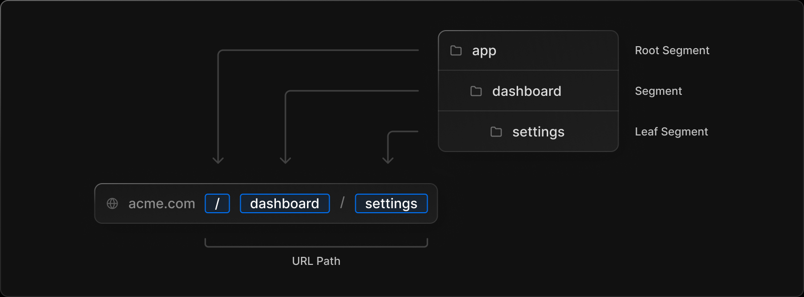
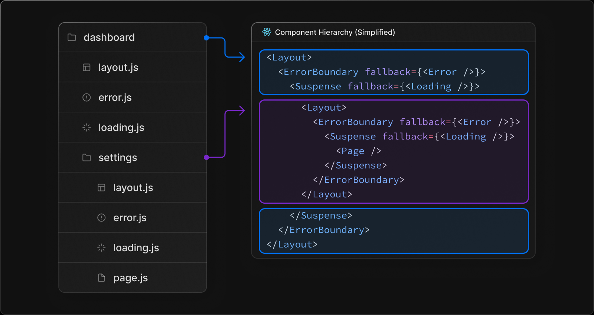
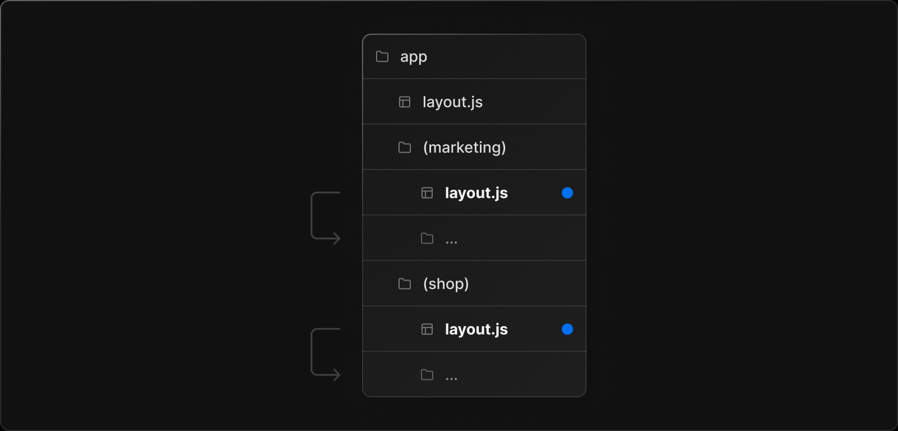
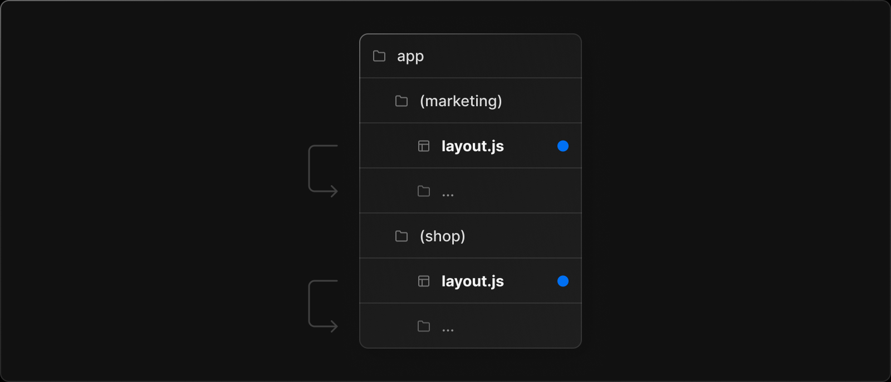
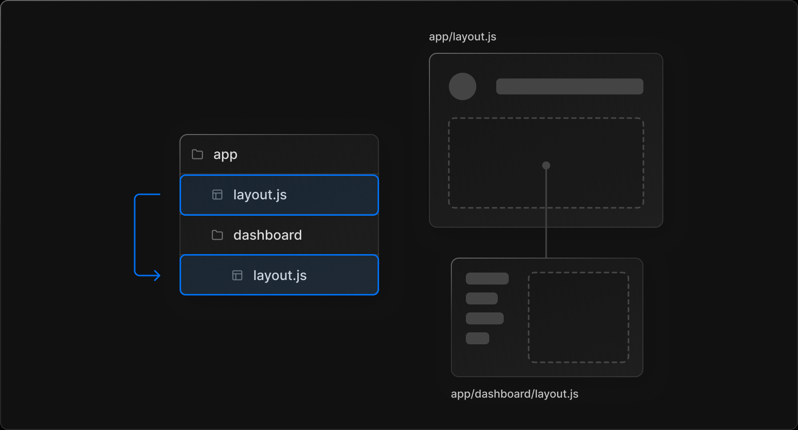

# 路由

## 路由基础

**文件名约定**

- page.tsx: 路由对应 UI;
- route.tsx: api 路由;
- layout.tsx: 布局 UI;
  - template.tsx: 现在不怎么懂;
- loading.tsx:加载 UI;
- error.tsx: 报错 UI;
  - global-error.tsx: 全局报错 UI, 在根目录下;
- not-found.tsx: 未找到页面 UI;

**默认组件类型**

- 默认为 server component;

**嵌套路由**

- 根据文件夹层级映射路由层级;
- page.tsx 对应路由片段;



**组件层级结构**



**服务器中心路由**

- 使用 server-centric routing;
- 客户端不必现在 route map;
- 不利于具有很多路由的页面;

**部分渲染**

- 当 next 在兄弟路由导航时;
- 仅会渲染路由改变的部分;

## 定义路由

### 创建路由

```bash
/app/dashboard/settings/page.tsx 对应 localhost:3333/app/dashboard/settings
```

### 路由组

**命名格式**

- 文件夹名称使用 (folderName) 形式;
- 路由组并不显示到 URL 中;



**作用**

- 不影响 URL 的前提下组织路由;
- 同一路由组共享 layout.tsx;
- 创建多个 root layout;

**注意**

- 不同路由组下的文件夹名不应该解析为相同的 URL;
- 跨路由组的导航会导致页面完全重新加载;

### 动态路由片段

**机制**

- 文件夹名使用 [...folderName] 形式;
- 传递 params 属性到 layout, page 和 route;

```typescript
// 文件路径为 app/blog/[slug]/page.tsx
// /blog/a	- { slug: 'a' }
// /blog/b	- { slug: 'b' }
// /blog/c	- { slug: 'c' }
export default function Page({ params }: { params: { slug: string } }) {
  return <h1>My Page</h1>;
}
```

**捕获所有路由**

- 文件夹名使用 \[\[...folderName\]\] 形式;
- 传递 params 属性到 layout, page 和 route;

```typescript
// 文件路径为 pp/shop/[[...slug]]/page.tsx
// /shop	    {}
// /shop/a	    { slug: ['a'] }
// /shop/a/b	{ slug: ['a', 'b'] }
// /shop/a/b/c	{ slug: ['a', 'b', 'c'] }

export default function Page({ params }: { params: { slug: string[] } }) {
  return <h1>My Page</h1>;
}
```

## page 和 layout

### page

**page**

- app 文件夹下恒有 page.tsx;
- page.tsx 对应路由片段;
- page.tsx 默认为 Server Components;
- page.tsx 可以获取数据;
- 使用 default export;

### layout

**layout**

- app 文件夹下恒有 layout.tsx;
- 被其路由片段下所有 page.tsx 共享;
- 嵌套子路由片段作为其子组件;
- layout.tsx 默认为 Server Components;
- layout.tsx 可以获取数据;
- layout.tsx 包裹 page.tsx;
- 使用 default export;

**root layout**

```typescript
// 在 app 目录下
// 应用于所有 routes
// 必须使用 html 和 body 标签
// 只能是 Server Component
export default function RootLayout({ children }: { children: React.ReactNode }) {
  return (
    <html lang="en">
      <body>{children}</body>
    </html>
  );
}
```

**创建多个 root layout**



**嵌套 layout**

- 应用于对应路由片段;
- 子 layout.tsx 嵌套于父 layout.tsx 上;



### template

**template**

- 类似于 layout;
- 但是在导航切换时会创建一个新的实例, 重新渲染子组件;
- 能不用就不用;
- 使用 default export;

**适用场景**

- css 动画;
- 依赖于 useEffect 和 useState;
- 切换路由改变页面默认行为;

**嵌套**

```typescript
// template 依旧嵌套于 Layout 下
// 通过 key 属性导致切换路由重新渲染子组件;
<Layout>
  <Template key={routeParam}>{children}</Template>
</Layout>
```

### 修改 \<head\>

**语法格式**

```typescript
// 定义于 layout.tsx 或 page.tsx
// 使用 metadata object
export const metadata = {
  title: "Next.tsx",
};

export default function Page() {
  return "...";
}
```

**限制**

- 只能用于 Server Component;

## 链接和导航

### \<Link\> 组件

**\<Link\> 组件**

- \<a\> 的拓展;
- 用于客户端路由的导航;

**语法格式**

```typescript
import Link from "next/link";

export default function Page() {
  return <Link href="/dashboard">Dashboard</Link>;
}
```

### useRouter() hook

**语法格式**

```typescript
// 用于客户端组件
// 非必要不使用
"use client";
import { useRouter } from "next/navigation";

export default function Page() {
  const router = useRouter();

  return (
    <button type="button" onClick={() => router.push("/dashboard")}>
      Dashboard
    </button>
  );
}
```

### 工作原理

**机制**

- 使用 \<Link\> 或 router.push() 切换路由;
- 路由更新浏览器 URL;
- 使用缓存;
  - 路由器通过从客户端缓存中重新使用未更改的部分;
  - 符合软导航的从客户端缓存中获取, 不符合则从服务器获取;

**客户端缓存**

- 服务器组件的渲染结果存储在客户端缓冲中;
- 根据路由片段片段分隔;
- 路由器尽可能重复使用客户端缓存, 避免重新获取数据和渲染组件;

**无效缓存**

- 使用 route.refresh() 强制刷新路由;

**Prefetching**

- 在访问路由之前预先加载路由;
- 静态路由预先加载路由片段的所有服务器组件;
- 动态路由现在我看不懂;
- 仅在 production 环境中生效;

**硬导航**

- 不使用客户端缓存;
- 重新获取数据和渲染组件;

**软导航**

- 路由导航时, 如果更改路由片段缓存存在, 重复使用该缓存;
- 软导航的使用条件;
  - 对应路由片段已经 Prefetching;
  - 不使用动态路由和动态参数;

**前进和后退**

- 前进和后退操作为软导航行为;

## 加载 UI

**机制**

- 当路由片段内容处于加载状态时, 使用加载 UI;
- 路由片段内容加载完成后, 使用渲染内容;

**使用加载 UI**

```typescript
// 创建 loading.tsx
// 对应组件嵌套在 <Layout> 的 <Suspense> 中
// <Suspense> 包裹同级目录的 page.js 以及子树中的所有文件
export default function Loading() {
  // You can add any UI inside Loading, including a Skeleton.
  return <LoadingSkeleton />;
}
```

## 错误处理
