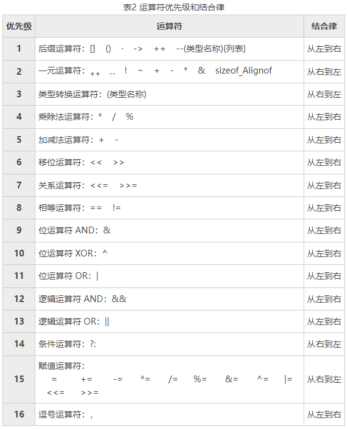

# 运算符

## 算术运算符

**算术运算符**

```c
int result = 34 * 56; // 乘
int result = 66 / 11; // 除
int result = 26 % 5; // 取余
int result = 3 ** 2; // 幂运算
int result = 1 + 2; // 加
int result = 2 - 1; // 减
```

**赋值运算符简写**

```c
i += 3;  // 等同于 i = i + 3
i -= 8;  // 等同于 i = i - 8
i *= 9;  // 等同于 i = i * 9
i /= 2;  // 等同于 i = i / 2
i %= 5;  // 等同于 i = i % 5
```

## 自增自减运算符

**自增自减操作符**

```c
// ++x, 先自增再返回值
// --x, 先自减再返回值
// x++, 先返回值再自增
// x--, 先返回值再自减
int num1 = 29;
int num2 = --num1 + 2; // 30
int num3 = num1-- + 2; // 31
```

## 关系运算符

**关系运算符**

| 运算符 | 机制                                                |
| ------ | --------------------------------------------------- |
| >      | 若左操作数大于右操作数返回 true, 反之返回 false     |
| >=     | 若左操作数大于等于右操作数返回 true, 反之返回 false |
| <=     | 若左操作数小于右操作数返回 true, 反之返回 false     |
| <=     | 若左操作数小于等于右操作数返回 true, 反之返回 false |
| ==     | 若相等返回 true, 反之返回 false                     |
| !=     | 若不相等返回 true, 反之返回 false                   |

## 逻辑运算符

**逻辑运算符**

| 操作符           | 含义 | 机制                  |
| ---------------- | ---- | --------------------- |
| !expr            | 非   | 转换为 boolean 并取反 |
| expr1 && expr2   | 与   | 一假即假, 全真才真    |
| expr1 \|\| expr2 | 或   | 一真即真, 全假才假    |

## 位运算符

**位运算符**

- 略;

## 逗号运算符

**逗号运算符**

- 从左向右依次运算;
- 返回最后一个表达式;

```c
x = 10, y = 20;
```

## 优先级和结合性


