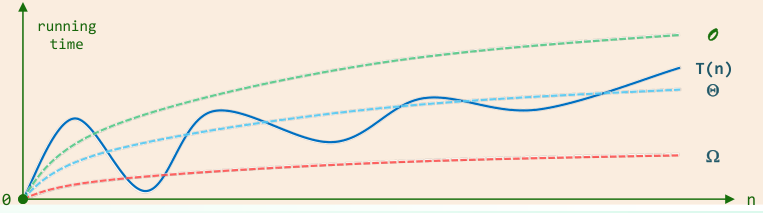
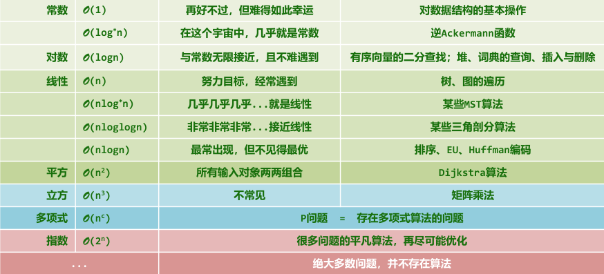
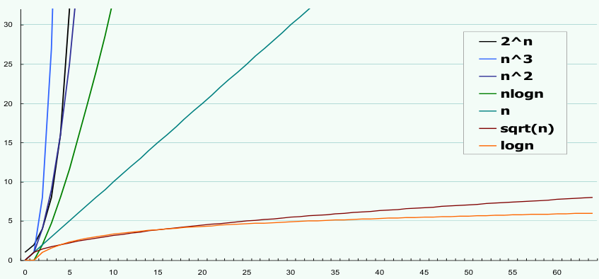

# 绪论

## 计算

**算法**

- 特定计算机模型;
- 解决特定问题的指令序列;

**算法的特征**

- 输入;
- 输出;
- 正确性: 可以解决特定问题;
- 确定性: 描述为指令序列;
- 可行性: 可在常数时间内完成;
- 有穷性: 任何输入, 经过有穷次操作, 都可得到输出;

## 渐进复杂度

**计算符号**

$T(n) = \Omicron(f(n)) \qquad if \exist c>0 \qquad s.t. \quad T(n) < c \cdot f(n) \qquad \forall n \gg 2$
$T(n) = \Omega(f(n)) \qquad if \exist c>0 \qquad s.t. \quad T(n) > c \cdot f(n) \qquad \forall n \gg 2$
$T(n) = \Theta(f(n)) \qquad if \exist c_1>c_2>0 \qquad s.t. \quad c_1 \cdot f(n) > T(n) > c_2 \cdot f(n) \qquad \forall n \gg 2$

**常见复杂度**

- $\Omicron(1)$: 常数;
- $\Omicron(log_c^n)$: 对数;
- $\Omicron(n^c)$: 幂函数;
- $\Omicron(c^n)$: 指数函数;

**层级划分**

**增长速度**

