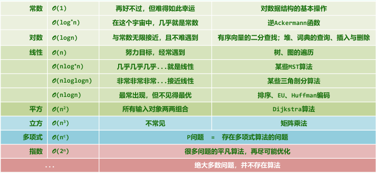

# 绪论

## 算法分析

**算法**

- 特定计算机模型;
- 解决特定问题的指令序列;

**算法的特征**

- 输入;
- 输出;
- 正确性: 可以解决特定问题;
- 确定性: 描述为指令序列;
- 可行性: 可在常数时间内完成;
- 有穷性: 任何输入, 经过有穷次操作, 都可得到输出;

## 数学基础

**时间复杂度**

$T(n) = \Omicron(f(n)) \qquad if \exist c>0 \qquad s.t. \quad T(n) < c \cdot f(n) \qquad \forall n \gg 2$
$T(n) = \Omega(f(n)) \qquad if \exist c>0 \qquad s.t. \quad T(n) > c \cdot f(n) \qquad \forall n \gg 2$
$T(n) = \Theta(f(n)) \qquad if \exist c_1>c_2>0 \qquad s.t. \quad c_1 \cdot f(n) > T(n) > c_2 \cdot f(n) \qquad \forall n \gg 2$

**常见复杂度**

- $1$: 常数;
- $log_c^n$: 对数;
- $n$: 线性;
- $n log_n$: 线性;
- $n^c$: 幂函数;
- $c^n$: 指数函数;

**层次划分**

**时间复杂度的计算**

- for 循环: 运行时间 \* 迭代次数;
- 嵌套 for 循环: for 循环的乘积;
- 顺序语句: 时间求和;
- 条件语句: 对应块中的最大运行时间;
