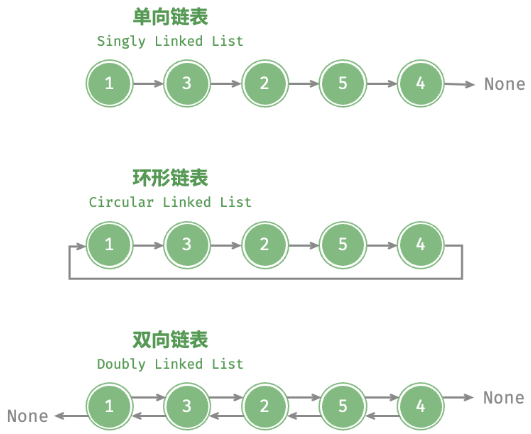

# 数组和链表

## 数组

**优点**

- 通过内存地址 O(1) 时间复杂度直接访问;

**缺点**

- 初始化长度不可变;
  - 超过数组范围元素丢失;
  - 内存浪费;
- 插入和删除效率低;
  - 时间复杂度为 O(n);

**数组遍历**

```typescript
/* 遍历数组 */
function traverse(nums) {
  let count = 0;
  // 通过索引遍历数组
  for (let i = 0; i < nums.length; i++) {
    count++;
  }
}
```

**数组查找**

```typescript
/* 在数组中查找指定元素 */
function find(nums, target) {
  for (let i = 0; i < nums.length; i++) {
    if (nums[i] == target) return i;
  }
  return -1;
}
```

## 链表

### 基础

**链表**

- 非线性数据结构

**节点**

- 节点值;
- 下一节点的引用;

```typescript
export class LinkedListNode<T> {
  value: T;
  next: LinkedListNode<T> | null;
  constructor(value: T, next: LinkedListNode<T> | null = null) {
    this.value = value;
    this.next = next;
  }
}
```

**尾节点**

- 尾节点指向 null;

**初始化指针**

```typescript
const n0 = new LinkedListNode(1);
const n1 = new LinkedListNode(3);
const n2 = new LinkedListNode(2);
const n3 = new LinkedListNode(5);
const n4 = new LinkedListNode(4);

n0.next = n1;
n1.next = n2;
n2.next = n3;
n3.next = n4;
```

### 链表变形

**单向链表**

- 节点值 + 后一节点的指针;

**环形链表**

- 尾节点指向第一个节点;

**双向链表**

- 节点值 +前一节点的指针 + 后一节点的指针;



### 链表操作

**插入**

- 改变插入位置前后两个指针;
- 时间复杂度为 O(1);

```typescript
function insert(value: LinkedListNode<T>, position: LinkedListNode<T>) {
  value.next = position.next;
  position.next = value;
  return value;
}
```

**删除**

- 改变删除位置前一个节点的指针;
- 双向链表时间复杂度为 O(1), 其余形式为 O(n);

```typescript
function remove(value: LinkedListNode<T>) {
  const node = this.findPrevious(value.value);
  if (!node) return false;
  if (this.isLast(node)) return false;
  const next = node.next as LinkedListNode<T>;
  node.next = next.next;
  return true;
}
```

**访问**

- 时间复杂度为 O(n);

```typescript
function find(value: T) {
  if (!this.head.next) return false;
  let node: LinkedListNode<T> | null = this.head;
  while (node) {
    if (node.value === value) return node;
    node = node.next;
  }
  return false;
}
```
