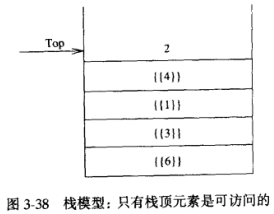
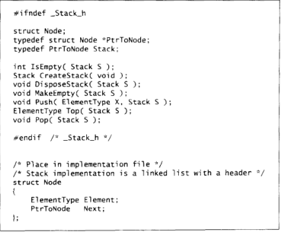
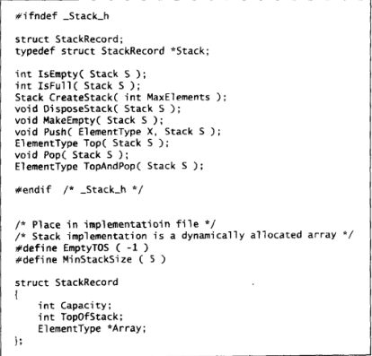
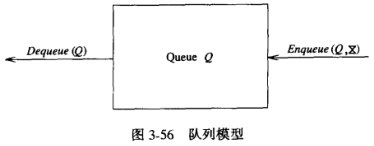
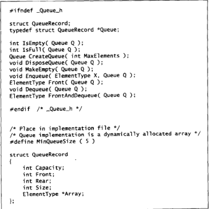

# 表, 栈和队列

## 抽象数据类型和数据结构

**抽象数据类型**

- 数据模型 + 操作;

**数据结构**

- 实现 ADT 的算法;

## 表

### 数组实现

**数组**

- 数组是一个元素顺序排列的表;

### 链表

**链表**

- 内存非顺序排列的结构组成;

**组成**

- 表元素;
- 指向后继元素的指针;
  - 最后一个元素的后继指针为 null;


**查询**

- 时间复杂度为线性;

**删除**

- 修改删除位置的元素的上一个元素的指针;
- 指向删除位置的元素的下一个元素;

**插入**

- 修改插入位置的元素的指针;
- 指向插入的元素;
- 插入元素的指针指向原位置元素指向的元素;

**表头**

- 无表元素;
- 指针指向表的第一个元素;

**ADT**

| 操作                    | 描述 | 时间复杂度 |
| ----------------------- | ---- | ---------- |
| isEmpty(list)           |      | 1          |
| isLast(node, list)      |      | 1          |
| find(node)              |      | n          |
| findPrevious(node)      |      | n          |
| delete(node)            |      | n          |
| insert(position, value) |      | 1          |


### 双链表

**组成**

- 表元素;
- 指向后继元素的指针;
  - 最后一个元素的后继指针为 null;
- 指向前继元素的指针;
  - 第一个元素的前继元素为表头;


**时间复杂度**

- 删除和插入开销增加一倍;
- 但是删除操作事件复杂度变为 1;

| 操作                    | 描述 | 时间复杂度 |
| ----------------------- | ---- | ---------- |
| isEmpty(list)           |      | 1          |
| isLast(node, list)      |      | 1          |
| find(node)              |      | n          |
| findPrevious(node)      |      | 1          |
| delete(node)            |      | 1          |
| insert(position, value) |      | 1          |

### 循环链表

**循环链表**

- 无表头;
- 最后一个元素的后继指针为第一个元素;
- 第一个元素的前驱指针为最后一个元素;


### 代码实现

**单向链表结点**

```typescript
export class LinkedListNode<T> {
  value: T;
  next: LinkedListNode<T> | null;
  constructor(value: T, next: LinkedListNode<T> | null = null) {
    this.value = value;
    this.next = next;
  }
}
```

**ADT**

```typescript
import { LinkedListNode } from "./linked_list_node";

export class LinkedList<T> {
  head: LinkedListNode<T>;
  constructor() {
    this.head = new LinkedListNode(null as T, null);
  }

  isEmpty() {
    return this.head.next === null;
  }

  isLast(node: LinkedListNode<T>) {
    return node.next === null;
  }

  find(value: T) {
    if (!this.head.next) return false;
    let node: LinkedListNode<T> | null = this.head;
    while (node) {
      if (node.value === value) return node;
      node = node.next;
    }
    return false;
  }

  findPrevious(value: T) {
    if (!this.head.next) return false;
    let node: LinkedListNode<T> | null = this.head;
    while (node) {
      if (!node.next) return false;
      if (node.next.value === value) return node;
      node = node.next;
    }
    return false;
  }

  delete(value: LinkedListNode<T>) {
    const node = this.findPrevious(value.value);
    if (!node) return false;
    if (this.isLast(node)) return false;
    const next = node.next as LinkedListNode<T>;
    node.next = next.next;
    return true;
  }

  insert(value: LinkedListNode<T>, position: LinkedListNode<T>) {
    value.next = position.next;
    position.next = value;
    return value;
  }
}
```

**双向链表结点**

```typescript
/* eslint-disable no-use-before-define */
export class DoublyLinkedListNode<T> {
  value: T;
  next: DoublyLinkedListNode<T> | null;
  before: DoublyLinkedListNode<T> | null;
  constructor(
    value: T,
    next: DoublyLinkedListNode<T> | null = null,
    before: DoublyLinkedListNode<T> | null = null
  ) {
    this.value = value;
    this.next = next;
    this.before = before;
  }
}
```

**ADT**

```typescript
import { DoublyLinkedListNode } from "./doubly_linked_list_node";

export class DoublyLinkedList<T> {
  head: DoublyLinkedListNode<T>;
  constructor() {
    this.head = new DoublyLinkedListNode(null as T, null, null);
  }

  isEmpty() {
    return this.head.next === null;
  }

  isLast(node: DoublyLinkedListNode<T>) {
    return node.next === null;
  }

  find(value: T) {
    if (!this.head.next) return false;
    let node: DoublyLinkedListNode<T> | null = this.head;
    while (node) {
      if (node.value === value) return node;
      node = node.next;
    }
    return false;
  }

  findPrevious(value: T) {
    if (!this.head.next) return false;
    let node: DoublyLinkedListNode<T> | null = this.head;
    while (node) {
      if (!node.next) return false;
      if (node.next.value === value) return node;
      node = node.next;
    }
    return false;
  }

  delete(value: DoublyLinkedListNode<T>) {
    const beforeNode = value.before;
    if (!beforeNode) return false;
    if (this.isLast(beforeNode)) return false;
    const next = beforeNode.next as DoublyLinkedListNode<T>;
    beforeNode.next = next.next;
    return true;
  }

  insert(value: DoublyLinkedListNode<T>, position: DoublyLinkedListNode<T>) {
    value.next = position.next;
    position.next = value;
    return value;
  }
}
```

## 栈

### 基础

**栈**

- 插入和删除只能在表端(栈顶)进行的表;
- 后进先出;



### 栈的单链表实现

**ADT**

| 操作           | 描述 | 时间复杂度 |
| -------------- | ---- | ---------- |
| isEmpty(stack) |      | 1          |
| push(value)    |      | 1          |
| pop()          |      | 1          |
| top()          |      | 1          |



**优缺点**

- 优点: 节省空间;
- 缺点: 开销较大;

### 栈的数组实现

**前提**

- 预先声明数组大小;
- 浪费一定空间;

**机制**

- 使用两个变量表示数组容量和栈顶位置;

**ADT**

| 操作        | 描述 | 时间复杂度 |
| ----------- | ---- | ---------- |
| isEmpty()   |      | 1          |
| isFull()    |      | 1          |
| push(value) |      | 1          |
| pop()       |      | 1          |
| top()       |      | 1          |



### 代码实现

**单链表**

```typescript
import { LinkedList } from "../linked_list/linked_list";
import { LinkedListNode } from "../linked_list/linked_list_node";

export class Stack<T> {
  private list: LinkedList<T>;
  constructor() {
    this.list = new LinkedList<T>();
  }

  isEmpty() {
    return this.list.isEmpty();
  }

  push(value: LinkedListNode<T>) {
    const head = this.list.head;
    this.list.insert(value, head);
    return true;
  }

  pop() {
    if (this.isEmpty()) return null;
    const head = this.list.head;
    const deletedNode = head.next as LinkedListNode<T>;
    this.list.delete(deletedNode);
    return deletedNode;
  }

  top() {
    if (this.isEmpty()) return null;
    return this.list.head.next as LinkedListNode<T>;
  }
}
```

**数组**

```typescript
export class StackArray<T> {
  private _array: T[];
  private _index: number;
  private _size: number;
  constructor(size: number) {
    this._size = size;
    this._array = new Array(size);
    this._index = -1;
  }

  isEmpty() {
    return this._index === -1;
  }

  isFull() {
    return this._index === this._size - 1;
  }

  push(value: T) {
    if (this.isFull()) return false;
    this._index += 1;
    this._array[this._index] = value;
    return true;
  }

  pop() {
    if (this.isEmpty()) return null;
    const popValue = this._array[this._index];
    this._array[this._index] = undefined as T;
    this._index -= 1;
    return popValue;
  }

  top() {
    if (this.isEmpty()) return null;
    return this._array[this._index];
  }
}
```

## 队列

### 队列

**队列**

- 插入在队尾进行;
- 删除在队头进行;
- 先进先出;



### 队列的数组实现

**实现机制**

- capacity: 数组容量;
- size: 元素个数;
- front: 队头;
- rear: 队尾;

**循环数组**

- 当 rear 到达数组末端时;
- 下一位置为数组的第一个位置;

**ADT**

| 操作           | 描述 | 时间复杂度 |
| -------------- | ---- | ---------- |
| isEmpty()      |      | 1          |
| isFull()       |      | 1          |
| enqueue(value) |      | 1          |
| dequeue()      |      | 1          |



### 代码实现

```typescript
export class QueueArray {
  private _capacity: number;
  private _size: number;
  private _front: number;
  private _rear: number;
  private _array: unknown[];
  constructor(capacity: number) {
    this._capacity = capacity;
    this._size = 0;
    this._front = 0;
    this._rear = 0;
    this._array = new Array(capacity);
  }

  isEmpty() {
    return this._size === 0;
  }

  isFull() {
    return this._size === this._capacity;
  }

  enQueue(value: unknown) {
    if (this.isFull()) return false;
    this._array[this._rear] = value;
    this._size += 1;
    if (this._rear === this._capacity - 1) this._rear = 0;
    else this._rear += 1;
    return true;
  }

  deQueue() {
    if (this.isEmpty()) return false;
    this._array[this._front] = undefined;
    this._size -= 1;
    if (this._front === this._capacity - 1) this._front = 0;
    else this._front += 1;
    console.log(this._front);
    return true;
  }
}
```
