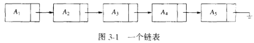
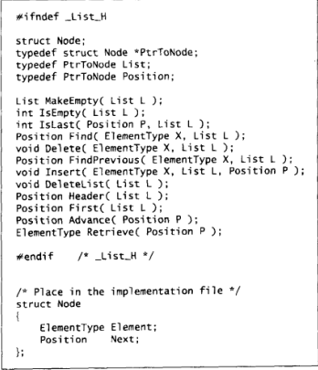
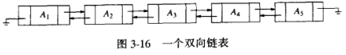
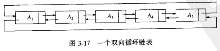
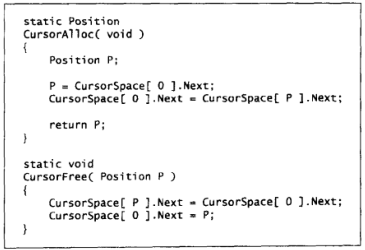
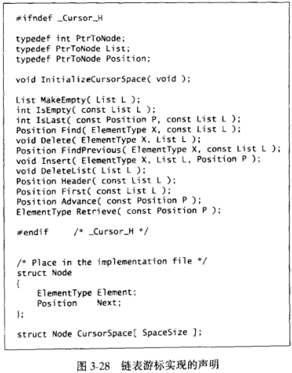

# 表, 栈和队列

## 抽象数据类型和数据结构

**抽象数据类型**

- 数据模型 + 操作;

**数据结构**

- 实现 ADT 的算法;

## 表

### 数组实现

**查询**

- 时间复杂度为 1;

**插入和删除**

- 事件复杂度为 n;

### 链表

**链表**

- 内存非顺序排列的结构组成;

**组成**

- 表元素;
- 指向后继元素的指针;
  - 最后一个元素的后继指针为 null;

**查询**

- 时间复杂度为线性;

**删除**

- 修改删除位置的元素的上一个元素的指针;
- 指向删除位置的元素的下一个元素;

**插入**

- 修改插入位置的元素的指针;
- 指向插入的元素;
- 插入元素的指针指向原位置元素指向的元素;

**表头**

- 无表元素;
- 指针指向表的第一个元素;

**ADT**

| 操作                    | 描述 | 时间复杂度 |
| ----------------------- | ---- | ---------- |
| isEmpty(list)           |      | 1          |
| isLast(position, list)  |      | 1          |
| find(value)             |      | n          |
| findPrevious(value)     |      | n          |
| delete(value, position) |      | n          |
| insert(position, value) |      | 1          |

### 双链表

**组成**

- 表元素;
- 指向后继元素的指针;
  - 最后一个元素的后继指针为 null;
- 指向前继元素的指针;
  - 第一个元素的前继元素为表头;

**插入和删除**

- 开销增加一倍;
- 但是删除操作事件复杂度变为 1;

### 循环链表

**循环链表**

- 无表头;
- 最后一个元素的后继指针为第一个元素;
- 第一个元素的前驱指针为最后一个元素;

### 链表的游标实现

**全局结构体数组**

- 通过数组的下标表示结构体的地址;

**malloc 和 free 的实现**

**null 值的表示**

- 使用 0 作为 null 值;

**实现声明**

