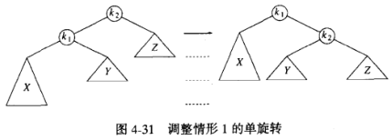
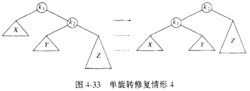
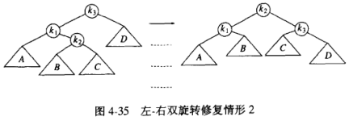
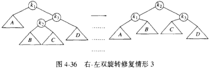
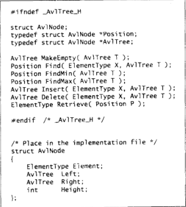

# 树

## 基础

### 基本概念

**树**

- 树具有一个根节点;
- 节点具有任意个节点;
- 节点之间通过边连接;
- 一个树具有 n 个节点和 n - 1 条边;

**树叶**

- 没有子节点的节点;

**兄弟节点**

- 具有相同父节点的节点;

**路径**

- 从 n1 到 nk 经过的节点序列 n1, ..., nk;
- 路径的长为边的条数, 即 k - 1;

**深度**

- 任意节点到根节点的路径的长;

**高**

- 节点到其子树中任意树叶最长路径的长;

### 树的实现

**节点声明**

- 元素值 + 儿子节点指针 + 兄弟节点指针;

## 二叉树

### 基础

**二叉树**

- 每个节点最多两个子节点的树;
- 平均深度为 $\sqrt{N}$

### 实现

**节点声明**

- 元素值 + 左子树指针 + 右子树指针 + 父节点指针;

### 二叉树的遍历

**先序遍历**

- 根节点 - 左子树 - 右子树;
- 4 - 2 - 1 - 3 - 6 - 5 - 7;

**中序遍历**

- 左节点 + 根节点 + 右节点;
- 1 - 2 - 3 - 4 - 5 - 6- 7;

**后序遍历**

- 左子树 - 右子树 - 根节点;
- 1 - 3 - 2 - 5 - 7 - 6 - 1;

## 二叉查找树 ADT

### 基础

**二叉查找树**

- 任意节点, 其值为 x;
- 其左子树的所有节点值小于 x;
- 其右子树的所有节点值大于 x;
- 平均深度为 $\log_2{N}$

### ADT

**ADT**

| 操作          | 描述 | 时间复杂度 |
| ------------- | ---- | ---------- |
| find(value)   |      | logN - N   |
| findMin()     |      | logN - N   |
| findMax()     |      | logN - N   |
| insert(value) |      | logN - N   |
| delete(value) |      | logN - N   |

**重复元的插入**

- 节点中设置一个属性记录;

**删除操作**

- 树叶: 立刻删除;
- 具有一个儿子: 儿子作为删除节点父节点的儿子;
- 具有两个儿子: 使用右子树中的最小节点代替;

**懒惰删除**

- 删除节点仍留在树中, 使用一个变量标识;
- 适合于具有重复关键字的情况;

## AVL 树

### 基础

**AVL 树**

- 具有平衡条件的树;
- 深度 logN;

**平衡条件**

- 左子树和右子树的高度最多差 1;

**时间复杂度**

- 除插入以外的操作结尾 logN;

**插入**

- 插入之后, 平衡可能改变;
- 沿着插入节点到根节点的路径;
- 可以找到一个破坏平衡的节点 a;
- 不平衡的情况;
  - a 的左儿子的左子树进行一次插入;
  - a 的左儿子的右子树进行一次插入;
  - a 的右儿子的左子树进行一次插入;
  - a 的右儿子的右子树进行一次插入;

### 单旋转

**应用场景**

- a 的左儿子的左子树进行一次插入;
- a 的右儿子的右子树进行一次插入;

**旋转机制**

- 以左左为参考示例;
- k2 不满足平衡条件;
- k1 变为新的根;
- k2 变为 k1 的右子树;
- k1 的右子树作为 k2 的左子树;

### 双旋转

**应用场景**

- a 的左儿子的右子树进行一次插入;
- a 的右儿子的左子树进行一次插入;

**旋转机制**

- 以左右为参考示例;
- k2 不满足平衡条件;
- k2 左子树作为 k1 右子树;
- k2 右子树作为 k3 左子树;
- k1 作为 k2 左子树;
- k3 作为 k2 右子树;

### ADT

**ADT**

| 操作          | 描述 | 时间复杂度 |
| ------------- | ---- | ---------- |
| find(value)   |      | logN       |
| findMin()     |      | logN       |
| findMax()     |      | logN       |
| insert(value) |      | logN       |
| delete(value) |      | logN       |

**删除操作**

- 删除操作复杂;
- 如无过多删除操作;
- 可使用懒惰删除;
