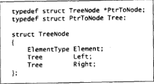

# 树

## 基础

### 基本概念

**树**

- 树具有一个根节点;
- 节点具有任意个节点;
- 节点之间通过边连接;
- 一个树具有 n 个节点和 n - 1 条边;


**树叶**

- 没有子节点的节点;

**兄弟节点**

- 具有相同父节点的节点;

**路径**

- 从 n1 到 nk 经过的节点序列 n1, ..., nk;
- 路径的长为边的条数, 即 k - 1;

**深度**

- 任意节点到根节点的路径的长;

**高**

- 节点到其子树中任意树叶最长路径的长;

### 树的实现

**节点声明**

- 元素值 + 儿子节点指针 + 兄弟节点指针;


## 二叉树

### 基础

**二叉树**

- 每个节点最多两个子节点的树;
- 平均深度为 $\sqrt{N}$

### 实现

**节点声明**

- 元素值 + 左子树指针 + 右子树指针;



### 二叉树的遍历

**先序遍历**

- 根节点 - 左子树 - 右子树;
- 4 - 2 - 1 - 3 - 6 - 5 - 7;

**中序遍历**

- 左节点 + 根节点 + 右节点;
- 1 - 2 - 3 - 4 - 5 - 6- 7;

**后序遍历**

- 左子树 - 右子树 - 根节点;
- 1 - 3 - 2 - 5 - 7 - 6 - 1;


## 二叉查找树 ADT

### 基础

**二叉查找树**

- 任意节点, 其值为 x;
- 其左子树的所有节点值小于 x;
- 其右子树的所有节点值大于 x;
- 平均深度为 $\log_2{N}$


### ADT

**ADT**

| 操作          | 描述 | 时间复杂度 |
| ------------- | ---- | ---------- |
| find(value)   |      | logN - N   |
| findMin()     |      | logN - N   |
| findMax()     |      | logN - N   |
| insert(value) |      | logN - N   |
| delete(value) |      | logN - N   |


**重复元的插入**

- 节点中设置一个属性记录;

**删除操作**

- 树叶: 立刻删除;
- 具有一个儿子: 儿子作为删除节点父节点的儿子;
- 具有两个儿子: 使用右子树中的最小节点代替;


**懒惰删除**

- 删除节点仍留在树中, 使用一个变量标识;
- 适合于具有重复关键字的情况;

### 代码实现

```typescript
/* eslint-disable no-use-before-define */
export class BinarySearchTreeNode {
  _value: number | null;
  _parent: BinarySearchTreeNode | null;
  _left: BinarySearchTreeNode | null;
  _right: BinarySearchTreeNode | null;
  constructor(
    value: number | null = null,
    parent: BinarySearchTreeNode | null = null,
    left: BinarySearchTreeNode | null = null,
    right: BinarySearchTreeNode | null = null
  ) {
    this._parent = parent;
    this._value = value;
    this._right = right;
    this._left = left;
  }

  find(value: number): BinarySearchTreeNode | null {
    if (this._value === null) return null;
    if (this._value === value) return this;
    if (this._left && this._value > value) {
      return this._left.find(value);
    }
    if (this._right && this._value < value) {
      return this._right.find(value);
    }
    return null;
  }

  findMin(): BinarySearchTreeNode {
    if (this._left === null) return this;
    return this._left.findMin();
  }

  findMax(): BinarySearchTreeNode {
    if (this._right === null) return this;
    return this._right.findMax();
  }

  insert(value: number): BinarySearchTreeNode | null {
    if (this._value === null) {
      this._value = value;
      return this;
    }

    if (this._value > value) {
      if (this._left === null) {
        this._left = new BinarySearchTreeNode(value);
        this._left._parent = this;
        return this._left;
      }
      this._left.insert(value);
      return this._left;
    }

    if (this._value < value) {
      if (this._right === null) {
        this._right = new BinarySearchTreeNode(value);
        this._right._parent = this;
        return this._right;
      }
      this._right.insert(value);
      return this._right;
    }

    return null;
  }

  delete(value: number): BinarySearchTreeNode | null {
    const node = this.find(value);
    if (node === null) return null;
    const parent = node._parent;
    // root
    if (parent === null) {
      throw new Error("root");
    }
    if (node._left && node._right) {
      const minNode = node._right.findMin();
      node._value = minNode._value;
      if (minNode._right) {
        (minNode._parent as BinarySearchTreeNode)._left = minNode._right;
        minNode._right._parent = minNode._parent as BinarySearchTreeNode;
      }
      node._parent = null;
      return node;
    }
    if (!node._left && !node._right) {
      if (parent._left?._value === value) parent._left = null;
      if (parent._right?._value === value) parent._right = null;
      node._parent = null;
      return node;
    }
    const children = (node._left || node._right) as BinarySearchTreeNode;
    if (parent._left === node) parent._left = children;
    if (parent._right === node) parent._right = children;
    node._parent = null;
    return node;
  }
}
```

```typescript
import { BinarySearchTreeNode } from "./binary_search_tree_node";

export class BinarySearchTree {
  _root: BinarySearchTreeNode;
  constructor(value: number | null = null) {
    this._root = new BinarySearchTreeNode(value);
  }

  find(value: number): BinarySearchTreeNode | null {
    return this._root.find(value);
  }

  findMin(): BinarySearchTreeNode {
    return this._root.findMin();
  }

  findMax(): BinarySearchTreeNode {
    return this._root.findMax();
  }

  insert(value: number): BinarySearchTreeNode | null {
    return this._root.insert(value);
  }

  delete(value: number): BinarySearchTreeNode | null {
    return this._root.delete(value);
  }
}
```
