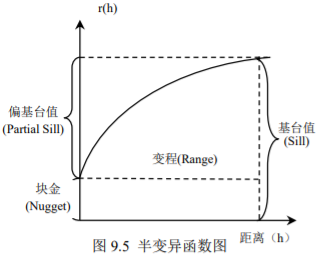

# GIS 空间统计分析

## 空间统计概述

### 基本概念

**空间统计分析**

- 空间数据的统计分析: 非空间特性的统计分析.
- 数据的空间统计分析
  - 基于空间对象的空间位置, 空间关系,
  - 研究具有空间相关性和依赖性的现象.

### 主要分析内容

- 基本统计量;
- 探索性数据分析;
- 常规统计与分析;
- 空间插值;
- 空间分布模式与空间关系建模.

## 基本统计量

### 代表数据集中趋势的统计量

**分类**

- 平均数;
- 中位数;
- 众数.

**作用**: 反映总体一般水平.  
**缺陷**: 掩盖个体差异.

### 代表数据离散程度的统计量

- 最值;
- 分位数;
- 极差: 最值之差;
- 离差: 数值与平均值之差;
- 平均离差;
- 离差平方和;
- 方差;
- 标准差;
- 变异系数: $C_v=\frac{s}{\overline{x}}*100\%$.

### 代表数据形态的统计量

**偏度**: 数据分布的不确定性.

- 左偏: < 0;
- 右偏: > 0.

**标准正态分布的偏度**: 0.

---

**峰度**: 数据分布的集中程度.

- 尖: > 3;
- 平: < 3.

**标准正态分布的峰度**: 3.

## 探索性数据分析

### 基本分析工具

**直方图**

- 采样数据分级,
- 统计各级别个数或百分比,
- 条带图或柱状图表示.

**作用**

- 数据分布特征;
- 数据总体规律;
- 检验数据分布;
- 寻找数据离群值.

---

**正态 QQ 图**  
**作用**

- 单变量样本数据是否服从正态分布,
- 若服从则图象呈直线.

**普通 QQ Plot 分布图**

- 评估两个数据集的分布的相似性,
- 若相似则图象呈直线.

---

**方差变异分析工具**  
**半变异函数**: .  
**块金值**: r(0).  
**基台值**: 半变异函数 r(h) 平稳时的常数.  
**偏基台值**: 基台值与块金值之差.  
**变程**: r(h) 到达基台值时的样点间隔距离.

---

**Voronoi 图**: 样点周围一系列多边形.  
**生成方法**: 多边形内任何位置距多边形内样点距离均小于据其他样点距离.  
**多边形值分配和计算方法**

- 简化;
- 平均;
- 模式;
- 聚类;
- 熵;
- 中值;
- 标准差;
- 四分位数间隔.

### 寻找数据的离群值

**全局离群值**

- 对于数据集所有点,
- 具有很高或很低的值.

**局部离群值**

- 对于观测样点相邻点,
- 具有很高或很低的值.

**寻找方式**

- 直方图;
- 半变异函数云图;
- Voronoi 图.

### 全局趋势分析

**全局趋势分析**: 空间数据总体变化趋势.  
**常用方法**: 透视分析.

### 空间自相关

**空间自相关**: 距离越近的事物越相似.  
**分类**

- 全局空间自相关分析: 整个研究区域.
- 局部空间自相关分析: 局部研究区域.

---

**空间自相关参数**

- 空间权重矩阵: 
- 莫兰指数
- G 系数

## 空间数据常规统计与分析

### 空间数据分级统计分析

**根据分级方法的多少**

- 单一分级法;
- 复合分级法.

**按级差是否相等**

- 等值分级法;
- 不等值分级法.

**按确定级差的方法可**

- 自定义分级;
- 模式分级: 算法自动设定.

### 空间数据分区统计分析

**分区统计**

- 不同空间实体,
- 数量特征, 几何特征,
- 基于某种空间结构聚合.

### 样方统计与核密度估计

**样方法**

- 随机抽样统计;
- 所有值统计.

**核密度估计**

- 基于概率密度函数,
- 连续表达 (直方图为离散表达).

## 空间内插

**内插**

- 内插点周围,
- 已知点高程值,
- 求未知点高程值.

**主要内容**

- 邻域范围;
- 已知点权重;
- 内插函数.

**分类**

- 数据分布;
  - 规则分布内插方法;
  - 不规则分布内插方法;
  - 等高线数据内插方法.
- 内插范围;
  - 整体内插方法;
  - 局部内插方法;
  - 逐点内插方法.
- 内插函数性质;
  - 多项式内插;
  - 样条内插;
  - 最小二乘配置内插.
  - 克里金内插;
  - 多层曲面叠加内插.

### 整体内插

**整体内插**

- 整体区域地形,
- 单个数学函数,
- 高次多项式.

**优点**

- 函数唯一;
- 全局光滑连续;
- 反映宏观地形特征.

**缺点**

- 保凸性较差;
- 不易得到稳定数值解;
- 多项式系数物理意义不明显;
- 不能提供局部地形特征.

### 局部内插

**局部内插**

- 研究区域分块,
- 每分块单独拟合, 内插.

**分块大小**

- 地形复杂程度;
- 地形采样点密度.

**优点**

- 局部地形特征;
- 较好的保凸性.

---

**内插函数**  
**线性内插**: H=ax+by+c.

---

**双线性内插**: H=ax+by+cxy+d.

---

**样条函数**: 分段低次多项式.

---

**Coons 曲面**: 基于任意四边形的曲面拟合方法.  
**Geomap 曲面**: Bezier 曲面在不规则格网划分的推广.

---

**多层曲面叠加内插**

- 垂直方向;
- 若干简单曲面按一定比例叠加.

---

**最小二乘配置**  
**构成部分**

- 趋势: 整体变化趋势;
- 信号: 局部数据之间的联系;
- 误差: 不确定性因素.

---

**克里金法**

- 构建半变异函数;
- 构建内插矩阵;
- 内插计算.

---

**有限元内插**

- 离散方式处理连续变量,
- 分割地形曲面成有限个单元的集合.

### 逐点内插

**逐点内插**

- 以内插点为中心,
- 确定邻域范围,
- 确定邻域内采样点,
- 确定内插函数,
- 内插计算.

**与局部内插的关系**

- 逐点内插本质是局部内插;
- 逐点内插邻域范围随采样点变化而变化.

**注意问题**

- 内插函数;
- 邻域大小和形状;
- 邻域内采样点数量;
- 采样点权重;
- 采样点分布;
- 附加信息的考虑.

## 空间分布模式与空间关系建模

### 空间分布特征统计

**平均中心**

- 研究区域中所有要素
- 平均 x 坐标和 y 坐标

**加权平均中心**: 各要素赋予权重.

---

**中位数中心**: 中心趋势的度量.  
**加权中位数中心**: 各要素赋予权重.  
**计算方法**:

- 迭代过程,
- 迭代优化候选中位数中心,
- 直至距所有要素的欧式距离之和最小.

---

**标准差椭圆**: 离散程度和方向趋势的度量.

- 椭圆扁率: 方向趋势;
- 椭圆大小: 离散程度;
- 长轴方向: 总体分布方向.

### 空间分布模式

**全局模式统计**: 宏观空间统计.  
**全局模式统计量**

- 平均最邻近度: 各要素距最近邻要素的距离平均值;
- 全局莫兰指数;
- G 统计量.

---

**局部模式统计**: 微观空间统计.  
**局部模式分析统计量**

- 平均最邻近度;
- 局部莫兰指数;
- G 统计量.

### 空间关系建模与探测

**最小二乘法 (OLS)**: 全局空间回归模型.

---

**地理加权回归 (GWR)**: 局部空间回归模型.

---

**地理探测器**: 探测空间分异性的统计学方法.
