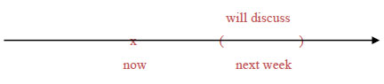

# 动词时态

## 基础

**简化动词时态**

- 动词时态繁多;
  - 主动/被动;
  - 现在/过去/未来;
  - 简单式/完成式/进行时/完成进行时;
- 简化;
  - 视 be 动词为动词;
  - 分词短语视为形容词补语;
  - 只保留简单式和完成式两种状态;

## 静态动词

**静态动词**

- 名不符实的动词;
- 称为动词, 但不含有动作, 表示一种状态;
- 静态动词无时态之分;

**常见的静态动词**

|         |      |          |           |
| ------- | ---- | -------- | --------- |
| be      | have | belong   | resembles |
| believe | like | consider |           |

## 简单式

### 基础

**简单式**

- 交代动作发生于什么时间;
- 除非上下文暗示;
- 必须指明事件;

**时间**

- 时间如同一个括弧;
- 现在时间是以 now 为中心的括弧;
- 括弧的大小不收限制;
- 过去时间是在 now 之前的括弧, 未来时间实在 now 之后的括弧;

### 过去时间

**示例一**

```json
// declare 使用过去式
The U.S. declared independence in 1776.
```


**示例二**

```json
// be 动词使用过去式, invented 作为形容词, 使用过去式表示被动
The dynamite was invented by the Chinese. 
```


**示例三**

```json
// when 子句表示过去时间, 主句保持一致
// be 动词使用过去式, playing 作为形容词, 使用进行式表示正在进行(短时间)
I was playing a video game when the power suddenly went out.
```


**示例四**

```json
// throughout last week 表示过去时间的一段时间, 主句保持一致
// be 动词使用过去式, working 作为形容词, 使用进行式表示持续进行(长时间)
I was working on my paper throughout last week.
```


**示例五**

```json
// when 子句表示过去时间, 主句保持一致
// be 动词使用过去式
// being renovated 作为形容词补语, being 表示正在进行(短时间), renovated 表示被动语态, 整体表示正在被翻修
The house was being renovated when it collapsed on the workers .
```


### 现在时间

**示例一**

```json
// 暗示现在
Wang Chien-Ming pitches for the Yankees.
```


**示例二**

```json
// is 暗示为现在时间
// located 作为形容词, 使用过去式表示被动
Our summer house is located on the lake.
```


**示例三**

```json
// now 表明现在时间
// be 动词使用原型, sleeping 作为形容词, 使用现在式表示正在进行
Please be quiet, because everybody is sleeping now.
```


**示例四**

```json
// this week 表示现在时间
// be 动词使用原型, selling 作为形容词, 使用现在式表示持续进行
This store is selling everything at a 30% discount this week, to celebrate its 20th anniversary
```


**示例五**

```json
// now 表示现在时间
// be 动词使用原型, closed 作为形容词, 使用过去式表示被动
// being widened 作为形容词, being 使用现在式表示正在进行, widened 使用过去式表示被动, 整体表示正在被拓宽
This road is closed to traffic now because it is being widened.
```

### 未来时间

**表达方式**

```json
// will + do
// 具有最浓厚的不确定语气, 表示可能会
John will leave tomorrow.

// be going to do
// 类似于 will, 口语化, 语气偏重于现在的意图, 打算, 预期
John is going to leave tomorrow.

// be to do, be doing 和 will be doing 等效于 be going to do, 省略 going
John is to leave tomorrow.
John is leaving tomorrow.
John will be leaving tomorrow.

// do
// 具有最肯定的语气, 将未来发生的事情作为事实
John leaves tomorrow.
```

**示例一**

```json
// next 表示未来时间
// 使用 will + do 表示可能会
I will discuss the plan with my boss next week.
```



**过去时间的未来**

- 以过去某个时间为基准;
- 使用 would + do;

```json
// mid-1945 表示过去时间
// would 表示过去时间的未来
It was mid-1945; Japan would soon raid Pearl Harbor.
```


