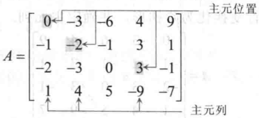
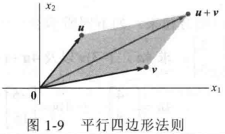
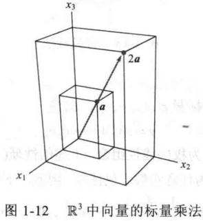
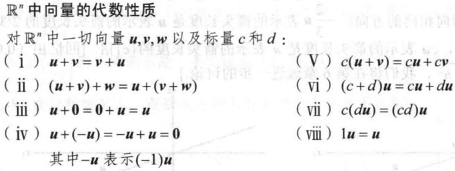
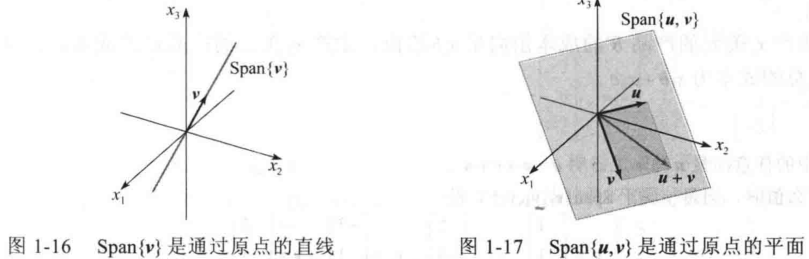

# 线性代数中的线性方程组

## 线性方程组

### 基础

**线性方程**

$a_1x_1 + a_2x_2 + ... + a_nx_n = b $

**线性方程组**

- 多个包含相同变量的线性方程;

**解和解集**

- 线性方程组的解是一组数, 使线性方程组成立;
- 所有解的集合称作线性方程组的解集;
- 若两个线性方程组具有相同的解集, 则两个线性方程组等价;

**解的情况**

- 无解;
- 唯一解;
- 无穷多解;

**相容和不相容**

- 若线性方程组有唯一解或无穷多解;
- 称其为相容, 否则不相容;

### 矩阵记号

**线性方程组示例**

$
\begin{aligned}
x_1 - 2x_2 + x_3 = 0 \\
2x_2 - 8x_3 = 8 \\
5x1 - 5x_3 = 10
\end{aligned}
$

**系数矩阵**

$
\begin{vmatrix}
1 & -2 & 1 \\
0 & -2 & -8 \\
5 & 0 & -5 \\
\end{vmatrix}
$

**增广矩阵**

$
\begin{vmatrix}
1 & -2 & 1 & 0 \\
0 & -2 & -8 & 8\\
5 & 0 & -5 & 10\\
\end{vmatrix}
$

**维数**

- 矩阵的行数和列数;
- $m \times n$ 矩阵为 m 行 n 列;

### 解线性方程组

**基本思路**

- 转换成更简单的等价方程组;

**初等行变换**

- 倍加变换: 方程变换为其与另一个方程的倍数的和;
- 对换变换: 交换方程位置;
- 倍乘变换: 某个方程所有项乘以非零数;

**行等价**

- 经过初等行变换的矩阵是行等价的;
- 具有相同的解集;

## 行化简与阶梯型矩阵

### 基础

**先导元素**

- 非零行中最左边的非零元素;

**行阶矩阵**

- 每一非零行都在每一零行之上;
- 某一行的先导元素所在的列位于前一行先导元素的右边;
- 某一先导元素所在列下方元素都是零;

**简化行阶矩阵**

- 每一非零行的先导元素是 1;
- 每一先导元素 1 是该元素所在列的唯一非零元素;

**简化行阶矩阵的唯一性**

- 每个矩阵行等价于唯一的简化阶梯形矩阵;

**符号表示**

- 行阶矩阵: A/REF;
- 化简行阶矩阵: U/RREF;

### 主元位置

**主元位置**

- A 中对应于它的行阶矩阵中先导元素 1 的位置;

**主元列**

- A 含有主元位置的列;

### 行化简算法

**步骤**

- 选择最左的非零列 (存在多个选择数值最大的) 放置于顶端并将其作为主元;
- 利用倍加行变换将该主元下面的元素变为 0;
- 选择次左的非零列, 递归使用以上步骤;
- 从最右的主元开始, 首先利用倍乘变换将其变为 1, 在把主元的上方元素变为 0;

### 线性方程的解

**基本变量和自由变量**

- 基本变量: 位于主元列的变量, 如 x1, x2;
- 其他变量: 如 x3;

$
\begin{vmatrix}
1 & 0 & 1 & 0 \\
0 & 1 & -8 & 8\\
0 & 0 & 0 & 0\\
\end{vmatrix}
$

**通解**

$
\begin{cases}
x_1 = 1+5x_3 \\
x_2=4-x_3\\
x3 \text{是自由变量} \\
\end{cases}
$

### 存在和唯一性问题

**存在和唯一性定理**

- 线性方程组相容的充要条件为增广矩阵的最右列不是主元列;
- 若线性方程组相容;
  - 无自由变量: 唯一解;
  - 有自由变量: 无穷解;

$[0 \cdots 0 b],\quad b \neq 0$

## 向量方程

### $R^2$ 中的向量

**列向量**

- 仅有一列的矩阵, 简称向量;

$$
u=\begin{vmatrix}
3\\
-1
\end{vmatrix}
$$

**向量相等**

- 矩阵对应元素相对能;

**向量加法**

$$
\begin{vmatrix}
3\\
-1
\end{vmatrix}
+
\begin{vmatrix}
1 \\
1
\end{vmatrix}=
\begin{vmatrix}
3+1\\
-1+1
\end{vmatrix}=
\begin{vmatrix}
4\\
0
\end{vmatrix}
$$

**标量乘法**

- 若 c 为实数 5 (又称为标量);
- u 为向量;

$$
cu=
5
\begin{vmatrix}
2 \\
1
\end{vmatrix}=
\begin{vmatrix}
10\\
5
\end{vmatrix}
$$

**向量的简写**

- (3, 1);

**$R^2$的几何表示**

- (x, y) 的几何表示为 (0, 0) 指向 (x, y) 的有向线段;

**向量加法的平行四边形法则**

- u + v 对应以 u, v, 原点为第三个顶点构成的平行四边形;

### $R^3$ 中的向量

**几何表示**

- (x, y, z) 的几何表示为 (0, 0, 0) 指向 (x, y, z) 的有向线段

### $R^n$ 中的向量

**矩阵形式**

$$
u=
\begin{vmatrix}
u_1 \\
u_2 \\
\vdots \\
u_n
\end{vmatrix}
$$

**零向量**

- 所有矩阵元素都是 0 的向量;

**向量的代数性质**

### 线性组合

**线性组合**

- 给定向量 $v_1, ... v_n$;
- 标量 $c_1, ... c_n$;
- 称下述公式为以 $c_1, ... c_n$ 为权的线性组合;

$$y=c_1 v_1+\cdots+c_p v_p$$

**向量方程和增广矩阵**

- $x_1 a_1+\cdots+x_n a_n=b$ 和 $[a_1 \cdots a_n \quad b]$ 有相同的解集;

**张成**

- 若 $v_1, ... v_n$ 是 $R^n$ 的向量;
- 则 $v_1, ... v_n$ 的所有线性组合构成的结合通过 $Span\{v_1, ... v_n\}$ 表示;
- 称作 $v_1, ... v_n$ 张成的 $R^n$ 的子集;

**向量方程**

- 判断向量 b 是否属于 $Span\{v_1, ... v_n\}$;
- 即判断下列向量方程是否有解;

$$c_1 v_1+\cdots+c_p v_p = b$$

### Span{v} 和 Span{u, v} 的几何表示

**Span{v}**

- 设 v 是 R3 中的向量;
- Span{v} 是 v 所有标量倍数的集合;
- 即过 v 和 0 的直线上所有点的集合;

**Span{u, v}**

- 设 u, v 是 R3 中的向量;
- Span{u, v} 是过 u, v 和 0 的平面上所有点的集合;
- Span{u, v} 包括 Span{u} 和 Span{v}

